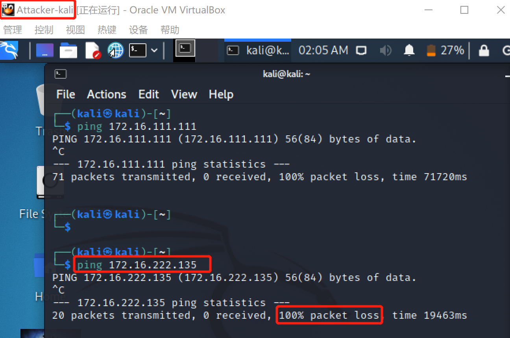

# 基于 VirtualBox 的网络攻防基础环境搭建

## 实验目的

- 掌握 VirtualBox 虚拟机的安装与使用；
- 掌握 VirtualBox 的虚拟网络类型和按需配置；
- 掌握 VirtualBox 的虚拟硬盘多重加载；

## 实验环境

以下是本次实验需要使用的网络节点说明和主要软件举例：

- VirtualBox 虚拟机
- 攻击者主机（Attacker）：Kali Rolling 2021.2
  * Attacker-kali
- 网关（Gateway, GW）：Debian Buster
  * debian-gw
- 靶机（Victim）：From Sqli to shell / xp-sp3 / Kali
  * victim-Kali-1
  * victim-XP-1
  * victim-Debian10-2
  * victim-XP-2

## 实验要求

- 虚拟硬盘配置成多重加载

- 搭建满足如下拓扑图所示的虚拟机网络拓扑；

- 完成以下网络连通性测试；
  - [x] 靶机可以直接访问攻击者主机
  - [x] 攻击者主机无法直接访问靶机
  - [x] 网关可以直接访问攻击者主机和靶机
  - [x] 靶机的所有对外上下行流量必须经过网关
  - [x] 所有节点均可以访问互联网


---

## 实验步骤

### 一、下载老师提供的资源文件，并挂载到虚拟机上

1. `kali-linux-2021.2-virtualbox-amd64.ova`的导入：在VirtualBox里 管理 -> 导入虚拟电脑 -> 选择ova文件即可。

2. `Debian10.vdi`和`xp_sp3_base.vdi`的导入：在VirtualBox里 新建 -> 略过一些基础名称和内存的设置 -> 在虚拟硬盘页面注册并选择vdi文件即可。 

   

3. 修改vdi文件为多重加载模式：在VirtualBox里 管理 -> 虚拟介质管理 -> 点击上述挂载的vdi文件`Debian10.vdi`和`xp_sp3_base.vdi` ->类型处更改为多重加载

   

   

### 二、根据网络拓扑图进行配置

1. 网关`debian-gw`

   * 网络地址转换(NAT)：使虚拟系统接入互联网，只需要宿主机器能访问互联网，虚拟机就能上网。
   * 仅主机（Host-only）网络：使虚拟系统可以访问主机
   * 内部网络‘intnet1’：建立局域网1
   * 内部网络‘intnet2’：建立局域网2

   

2. 攻击者`Attacker-kali`

   

   * 设置两块不同的host-only网卡：管理->主机网络管理器->创建一个新的host-only网卡并启用DHCP服务

     

3. 内部网络intnet1和intnet2的靶机

   * 各自使用内部网络intnet1和intnet2网卡
     * victim-kali-1\victim-XP-1:内部网络 ‘intnet1’
     * victim-XP-2\vixtim-Debian10-2:内部网络‘intnet2’

   

   


### 三、连通性测试

#### 1. 查看各个虚拟机ip地址

| 节点              | ip地址                        |
| ----------------- | ----------------------------- |
| Attacker-Kali     | 10.0.2.15/24（NAT）           |
| Victim-Kali-1     | 172.16.111.111/24（intnet1）  |
| Victim-XP-1       | 172.16.111.113/24（intnet1）  |
| Victim-Debian10-2 | 172.16.222.138/24（intnet2）  |
| victim-XP-2       | 172.16.222.135/24（intnet2）  |
| debian-gw         | 10.0.2.15/24（NAT）           |
|                   | 192.168.56.113/24 (host-only) |
|                   | 172.16.111.1/24（intnet1）    |
|                   | 172.16.222.1/24（intnet2）    |


#### 2.靶机可以直接访问攻击者主机

* 局域网1内靶机可以直接访问攻击者主机

  

* 局域网2内靶机可以直接访问攻击者主机

  

#### 3.攻击者主机无法直接访问靶机

* 攻击者无法直接访问intnet1的靶机

* 攻击者无法直接访问intnet2的靶机

  

  

#### 4.网关可以直接访问攻击者主机和靶机

* 网关可以直接访问攻击者主机

  

* 网关可以直接访问intnet1的靶机

  * 

  * 

    

* 网关可以直接访问intnet2的靶机

  * 
  * 

  

#### 5.靶机的所有对外上下行流量必须经过网关

使用Linux自带的对网络上的数据包进行截获的**包分析工具**`tcpdump`。在**靶机连接互联网的过程中用网关抓包**，若靶机发送的所有包都能被网关抓到，说明靶机的所有对外上下行流量必须经过网关。

1. 将靶机与互联网连通

   

2. 网关使用tcpdump抓包：

   ```cmd
   tcpdump -i enp0s3  # 监听经过接口enp0s3（NAT）的包
   ```

   

   

#### 6.所有节点均可以访问互联网

* 网关

  

* 攻击者

  

* intnet1的靶机（在网关`debian-gw`启动的情况下）

  * xp：
  * kali：

* intnet2的靶机（在网关`debian-gw`启动的情况下）

  * xp：
  * debian


---

## 问题及解决方法

1. 网关无法访问xp系统的靶机

   * 解决办法：在系统右下角关闭windows防火墙

     

2. 攻击者kali的host-only网络初始时未分配ip地址

   - 解决办法：修改配置文件 。添加以下信息，将`eth1`和`eth2`这两块网卡修改为**开机自启动**，并且**写入dhcp服务**从而动态获取路由分配的ip。

     ```cmd
     sudo vim /etc/network/interfaces
     
     auto eth1 
     iface eth1 inet dhcp #配置eth1使用DHCP协议
     auto eth2
     iface eth2 inet dhcp #配置eth2使用DHCP协议
     
     # 重启网卡，右上角会出现断开网络的图标
     /etc/init.d/network-manager restart
     ```

     

## 参考资料

[VirtualBox虚拟机几种网络连接方式介绍](https://blog.csdn.net/bifengmiaozhuan/article/details/79887692?ops_request_misc=%257B%2522request%255Fid%2522%253A%2522163145203616780271546379%2522%252C%2522scm%2522%253A%252220140713.130102334..%2522%257D&request_id=163145203616780271546379&biz_id=0&utm_medium=distribute.pc_search_result.none-task-blog-2~all~sobaiduend~default-2-79887692.first_rank_v2_pc_rank_v29&utm_term=virtualbox%E7%BD%91%E7%BB%9C%E9%85%8D%E7%BD%AE&spm=1018.2226.3001.4187)

[kali的网络设置及三种网络模式](https://www.codenong.com/cs109191978/)

