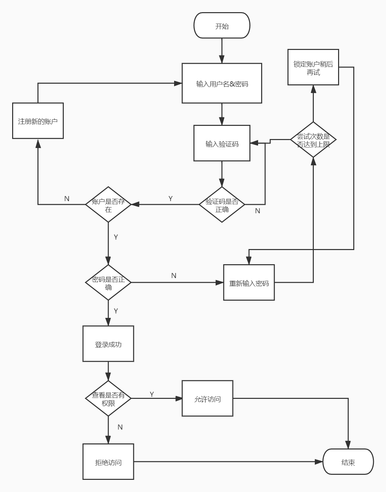

# EXP2-操作系统的访问控制设计实例研究

## 实验环境 

- 操作系统版本:iOS 15.0（19A346）
- 硬件设备型号:IPhone 12 （MGGV3CH/A）
- 是否默认设置:是

## 实验步骤

- 以 iOS 系统为研究对象

  - 当系统处于锁屏状态下接收到新短信时，不解锁情况下

    

    - 系统是否允许查看短信内容？**是**
    - 系统是否允许回复短信？**是**

  - 当系统处于锁屏状态下，使用系统内置（例如 iOS 的 Siri ）或第三方的语音助手可以完成以下哪些操作？

    - 访问通讯录 ：**不能**
    - 拨打电话：**能**
    - 访问相册：**不能**
    - 查看短信收件箱：**不能**

  - 如果你的手机支持指纹识别解锁手机，请实验并分析指纹识别相比较于简单密码、复杂密码、图形解锁、人脸识别解锁、声纹解锁等解锁方式的安全性、便利性差异。
  
    1. 简单密码：小于指纹解锁，可被分析破解或者统计破解。容易记住，比较方便。
    2. 复杂密码：分析破解更不容易，但是安全性还是没有指纹高。输入较为麻烦，记忆也不方便。
    3. 图形解锁：有可能被穷举分析，指纹则不存在此种攻击方式	解锁需要画图，相较指纹不容易。
    4. 人脸识别解锁：人脸识别主要是特征识别，安全性在特征唯一的情况下可以保证	方便，只需要人脸对着摄像头即可，但是可能受光线的影响。
    5. 声纹解锁：容易伪造。需要说话，在安静的环境不方便。
    6. 指纹解锁：指纹不容易出现重复，复制指纹不容易实现，安全性较好	比较方便，手指一按就解锁，但是有时候手湿会影响准确性。同时也要考虑指纹磨损、传感器上有污渍的情况。
  
    

### 思考题：

- 以上设计实现方式属于我们课堂上讲过的哪种强制访问控制模型？Lattice/BLP？Biba？
  * **属于 BLP模型**：对于刚接收的短信,所有客人用户（低安全等级）都可以对其查看，属于下读行为；可以回复短信，属于上写行为。*
  
- 系统或第三方应用程序是否提供了上述功能的访问控制规则修改？如果修改默认配置，是提高了安全性还是降低了安全性？

  是。我认为是降低了安全性，倘若用户设置不当，而对应应用脱离了操作系统的控制，就可能产生隐患。

## 课后习题

1. 生物特征身份认证方式有哪些？优缺点分析？应用场景举例。

   1. 指纹认证
      * 优点
        * 相对较低的成本
        * 采集简单
        * 具有个体独特性
      * 缺点
        * 在生物特征认证中易于复制，因此安全性受到质疑
        * 读取精度受手指的干燥度和皮肤油脂状况的影响
        * 容易被伪造出来，一旦被伪造就难以更改认证。
      * 实例
        * 解锁智能手机或PC
        * 出勤管理
        * 付款身份验证
   2. 人脸认证
      * 优点
        * 难以复制个人的脸部，相对安全
        * 人脸识别的准确性要高于虹膜、指纹的识别
        * 无侵害性
        * 对用户最自然、最直观
        * 采集成本低
      * 缺点
        * 现有技术的认证准确性有待提高
        * 若戴上口罩或眼镜，暴露在光线下，或者由于老化或重量波动而导致形状变化，则可能无法识别。
        * 人脸具有易变性，需要多次采集才能得到比较理想的效果
      * 实例
        - 游乐设施的入场检查
        - 大学的出入身份认证
        - 交通工具如车站的出入口
        - 最新的手机解锁方式

   3. 虹膜认证

      * 优点：
        * 具有个体独特性
        * 识别速度较快
      * 缺点：
        * 虹膜受老化的影响较小，甚至双胞胎也可以验证差异，因此可以实现高度精确的生物特征认证。
        * 有识别距离限制
        * 用于虹膜识别的硬件设备小型化不容易；
        * 相较于其它生物识别硬件，虹膜识别硬件造价较高，大范围推广困难；
      * 实例：
        - 解锁智能手机
        - 煤矿工人的考勤
        - 公安对于犯罪嫌疑人的身份采集

   4. 指静脉认证

      * 优点

        * 无需担心形状会随着年龄而变化。
        * 具有很高的唯一性 ，因此具有安全性和认证准确性高的特点。
        * 准确性比指纹认证的准确性高十倍以上，因此很难伪造或复制。

      * 缺点

        * 采集设备有特殊要求，设计相对复杂，制造成本高。

      * 实例

        **实例**

        - 银行的atm机
        - 门禁考勤管理

   5. 声纹认证

      * 优点：
        * 方便快捷
        * 非常原始且难以伪造
      * 缺点：
        * 不同的麦克风和信道对识别性能有影响
        * 环境噪音对识别有干扰
      * 实例：
        - 实用例智能音箱
        - 公寓出入管理
        - 医疗机构

   

2. “找回口令功能”和“忘记密码”在访问授权机制中的意义？请尝试设计几种安全的“找回口令功能”，详细描述找回口令的用户具体操作过程。

   1. 意义：
      认证的实现过程就是将主体身份标识唯一的绑定到主体的过程。 身份认证是访问授权的基础。

      因为只有通过身份认证后用户才能获得相应的权限。而且如果用户忘记了密码（无法通过认证），就无法获得原先已有的权限。

      “找回口令功能”和“忘记密码”实际上是**重置口令**，通过给用户的邮箱发送具有时效性的带有特殊标识的链接，或是给用户手机发送有时效性的验证码/拨打电话提供验证码，完成密码重置。

   2. 安全的“找回口令功能”：

      只要窃取了用户的手机/监视用户的邮箱即可重置用户账户的密码，因此需结合多种手段才能达到相对安全，如:

      * 重置密码时用手机短信码来确认身份，然后才允许发送重置链接到用户邮箱从邮箱点击重置链接后，允许更改密码，但需要回答一个随机的（注册时设置的）安全问题；
      * 从邮箱点击重置链接后，允许更改密码，但需要回答一个随机的（注册时设置的）安全问题；
      * 用户主动发送验证码至特定邮箱/号码，完成身份认证后再进行下一步重置操作。

3. 绘制用户使用用户名/口令+图片验证码方式录系统的流程图。考虑认证成功和失败两种场景，考虑授权成功和失败两种场景。

   

4. Windows XP / 7 中的访问控制策略有哪些？访问控制机制有哪些？

   自主访问控制 (Discretionary Access Control, DAC)

   - 访问令牌 (access token)
   - 安全描述符 (security descriptors)
     - 安全标识 (security identifiers, SID)
     - 访问控制列表 (access control list, ACL)
       - 自主访问控制列表(discretionary access control list, DACL)
         - 访问控制项(access control entries, ACE)
       - 系统访问控制列表(system access control list, SACL)

5. 用权限三角形模型来理解并描述下 2 种威胁模型：提权、仿冒。

   ##### 权限三角模型：用户 → 角色（分级） → 权限（对象+操作）

   

   ##### 提权

   - 提权分为：水平特权提升、垂直特权提升。
   - 提权是指本来没有某项权限的用户，通过一定的方法获得该权限，简而言之，用户以自己的身份获得了本不属于自己的权限。
     - e.g.1 用户A本来只能对一个文件进行查看，但是通过提权获得了对文件修改的权利（垂直提权）。
     - e.g.2 用户A本来只能查看自己的文件，通过提权可以查看B的文件（水平提权）。
   - 提权是用户→角色→权限，角色不变，而获取的权限扩大。

   ##### 仿冒

   - 仿冒是指用户A以用户B的身份通过了认证，之后行使了B所有的权利
   - 仿冒是用户→角色，获取的角色改变，所以能够行使的权限也就因角色的改变而改变了

6. 试通过操作系统的访问控制机制来达到预防一种真实病毒的运行目的。

   可以通过修改**组策略**防止蠕虫病毒，如熊猫烧香.

   - 利用自动播放功能；
   - 添加注册表自启动；
   - 定时关闭特定程序，如杀毒软件、防火墙；
   - 删除文件；
   - ……

   也就是说，如果能根据先验知识限制系统服务的运行、限制文件的操作等，就能有针对性地预防某一病毒。

7. 什么是 OAuth？

   * 开放授权OAuth(Open Authorization)是一种开放的协议，为桌面、手机或web应用提供了一种简单的，标准的方式去访问需要用户授权的API服务。

   * OAuth协议为用户资源的授权提供了一个安全的、开放而又简易的标准。与以往的授权方式不同之处是OAuth的授权不会使第三方触及到用户的帐号信息（如用户名与密码），即第三方无需使用用户的用户名与密码就可以申请获得该用户资源的授权，因此OAuth是“安全的”。
   * 协议特点：
     * 简单：不管是OAUTH[服务提供者](https://baike.baidu.com/item/服务提供者/12725153)还是应用开发者，都很易于理解与使用；
     * 安全：没有涉及到用户密钥等信息，更安全更灵活；
     * 开放：任何服务提供商都可以实现OAUTH，任何软件开发商都可以使用OAUTH；

8. 什么是 OpenID？

   * OpenID是一个身份认证协议，侧重于确定“用户是谁”，即认证用户所声称的身份是否真实。

   * OpenID是一个去中心化的网上身份认证系统。对于支持OpenID的网站，用户不需要记住像用户名和密码这样的传统验证标记。取而代之的是，他们只需要预先在一个作为OpenID身份提供者（identity provider, IdP）的网站上注册。OpenID是去中心化的，任何网站都可以使用OpenID来作为用户登录的一种方式，任何网站也都可以作为OpenID身份提供者。

   * OpenID既解决了问题而又不需要依赖于中心性的网站来确认数字身份。

9. 试用本章所学理论分析 0Auth 和 OpenID 的区别与联系。

   - OpenID只做身份认证，没有授予权限。

   - OAuth授予第三方应用访问受保护的信息的权限。提供了授权机制。

   - 仅需作单纯的身份认证时没必要用到OAuth，用到第三方网站的外部服务时才需使用OAuth。

   - OAuth关注的是授权，即：“用户能做什么”；而OpenID关注的是证明，即：“用户是谁”。

     

10. 如何使用 OAuth 和 OpenID 相关技术实现单点登录（Single Sign On）？

    * 单点登录 (SSO) 指的是当有多个系统需要登录时，用户只需登录一个系统，就可以访问其他需要登录的系统而无需登录。用户只需要登录一次就可以访问权限范围内的所有应用子系统。对于用户而言，访问多个应用子系统只需要登录一次，同样在需要注销的时候也只需要注销一次。
      * 举个简单的例子，你在百度首页登录成功之后，你再访问百度百科、百度知道、百度贴吧等网站也会处于登录状态了，这就是一个单点登录的真实案例。
    * 利用OpenID对单点登录的用户进行身份认证，认证成功后，通过OAuth授予第三方应用访问受保护的信息的权限，实现登录一次就可以访问权限范围内的所有应用子系统。

    

## 参考资料

* [什么是生物识别认证？](https://blog.csdn.net/Pixsur/article/details/110042457?utm_medium=distribute.pc_relevant.none-task-blog-2~default~baidujs_title~default-0.no_search_link&spm=1001.2101.3001.4242)
* [OWASP Forgot Password Cheat Sheet](https://www.owasp.org/index.php/Forgot_Password_Cheat_Sheet)
* [Managing Authorization and Access Control](https://docs.microsoft.com/en-us/previous-versions/windows/it-pro/windows-xp/bb457115(v%3dtechnet.10))
* [Access Control (Authorization)](https://docs.microsoft.com/en-us/windows/win32/secauthz/access-control)
* [5分钟了解OAuth2与OpenID ](https://cloud.tencent.com/developer/article/1819313)
* [OpenID及其原理介绍](https://blog.csdn.net/xcjing/article/details/73826889)