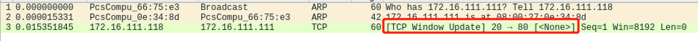
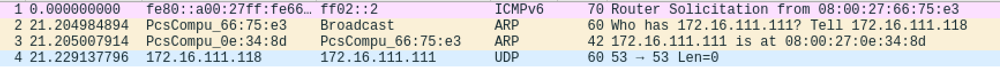

# EXP5-基于 Scapy 编写端口扫描器

## 实验目的

- 掌握网络扫描之端口状态探测的基本原理

## 实验环境

- Python 3.9.7 [GCC 10.3.0] on linux
- [scapy](https://scapy.net/) 2.4.4
- nmap 7.91

- 网络拓扑：

  * 使用类似第四节实验的拓扑结构，Attacker作为扫描端，Victim作为被扫描的靶机。

  


## 实验要求(完成度)

* 禁止探测互联网上的 IP ，严格遵守网络安全相关法律法规

- [x] TCP connect scan / TCP stealth scan
- [x] TCP Xmas scan / TCP fin scan / TCP null scan
- [x] UDP scan
- [x] 上述每种扫描技术的实现测试均需要测试端口状态为：`开放`、`关闭` 和 `过滤` 状态时的程序执行结果
- [x] 提供每一次扫描测试的抓包结果并分析与课本中的扫描方法原理是否相符？如果不同，试分析原因；
- [x] 在实验报告中详细说明实验网络环境拓扑、被测试 IP 的端口状态是如何模拟的
- [x] （可选）复刻 `nmap` 的上述扫描技术实现的命令行参数开关


## 实验过程

### 端口状态模拟

- **关闭状态**：对应端口没有开启监听, 防火墙没有开启。

  ```bash
  ufw disable
  ```

- **开启状态**：

  对应端口开启监听: 

  * apache2基于TCP, 在80端口提供服务; 
  * DNS服务基于UDP,在53端口提供服务。防火墙处于关闭状态。

  ```bash
  systemctl start apache2 # port 80
  systemctl start dnsmasq # port 53
  ```

- **过滤状态**：对应端口开启监听, 防火墙开启。

  ```bash
  ufw enable && ufw deny 80/tcp
  ufw enable && ufw deny 53/udp
  ```


### TCP connect scan

> `TCP connect scan`使用最基本的TCP三次握手链接建立机制。
>
> 首先发送一个`SYN`数据包到目的主机的特定端口上，然后等待目的主机回应。如果接收到为`RST/ACK`数据包，说明目标端口处于**关闭状态**并且链接将会被重置；如果有接受到`SYN/ACK`数据包，说明目标端口处于**开放状态**；没有任何响应则意味着目标主机的端口处于**过滤状态**。
>
> 若接收到 `SYN/ACK` 数据包（即检测到端口是**开启**的），便发送一个 ACK 确认包到目标主机，这样便完成了三次握手连接机制。成功后再终止连接。

 [tcp_connect_scan.py](code/tcp_connect_scan.py) 

* 端口状态为`关闭`
  * Attacker进行代码测试
  * 靶机抓包
    * 攻击者接收到为`RST/ACK`数据包，说明目标端口处于**关闭状态**并且链接将会被重置
  * nmap复刻

* 端口状态为`开放` 

  * Attacker进行代码测试

    

  * 靶机抓包

    

    * 攻击者接受到 `SYN/ACK` 数据包（即检测到端口是**开启**的），便发送一个 ACK 确认包到目标主机，完成了三次握手连接机制。

  * nmap复刻

  

* 端口状态为 `过滤`
  * Attacker进行代码测试
  * 靶机抓包
    * 攻击者发送SYN数据包后没有任何响应，说明是过滤状态
  * nmap复刻


### TCP stealth scan

 [tcp_stealth_scan.py](code/tcp_stealth_scan.py) 


> 与上述`TCP connect scan`类似，只是在发送者接收到 `SYN/ACK` 数据包（即检测到端口是**开启**的），便发送一个 **R 确认包**到目标主机，完成了三次握手连接机制。成功后再终止连接。


* 端口状态为`关闭` 
  * Attacker进行代码测试
  * 靶机抓包
    * 攻击者发送S包接收到R,A包，说明该端口处于关闭状态
  * nmap复刻

* 端口状态为`开放` 
  * Attacker进行代码测试
  * 靶机抓包
    * 攻击者再发送一个RST数据包
  * nmap复刻

* 端口状态为 `过滤`
  * Attacker进行代码测试
  * 靶机抓包
    * 攻击者发送SYN包后未收到回复
  * nmap复刻

### TCP Xmas scan 

 [TCP_Xmas_scan.py](code/TCP_Xmas_scan.py) 

> `TCP Xmas scan、TCP fin scan`及`TCP null scan`不涉及三次交互。它们都是先发送一个包，然后根据目标主机是否回复`R`来目标端口的状态。不同的是：
>
> - TCP Xmas scan发送的是`FPU`
> - TCP fin scan发送的是`F`
> - TCP null scan发送的包里没有设置任何flag
>
> Xmas 发送一个 TCP 包，并对 TCP 报文头 FIN、URG 和 PUSH 标记进行设置。若是关闭的端口则响应 RST 报文；开放或过滤状态下的端口则无任何响应。

* 端口状态为`关闭`  
  * Attacker进行代码测试
  * 靶机抓包
    * 靶机响应RST包
  * nmap复刻

* 端口状态为`开放` 
  * Attacker进行代码测试
  * 靶机抓包
    * 靶机未响应
  * nmap复刻

* 端口状态为 `过滤`

  * Attacker进行代码测试

    

  * 靶机抓包

    * 靶机未响应

  * nmap复刻

### TCP fin scan 

 [TCP_fin_scan.py](code/TCP_fin_scan.py) 

> 发送 FIN 包，它可以直接通过防火墙，如果端口是关闭的就会回复一个 RST 包，如果端口是开放或过滤状态则对 FIN 包没有任何响应。

* 端口状态为`关闭`  
  * Attacker进行代码测试
  * 靶机抓包
    * 靶机收到FIN包，回复RST包
  * nmap复刻

* 端口状态为`开放` 
  * Attacker进行代码测试
  * 靶机抓包
    * 靶机收到FIN包后无响应
  * nmap复刻

* 端口状态为 `过滤`
  * Attacker进行代码测试
  * 靶机抓包
    * 靶机收到FIN包后无响应
  * nmap复刻

### TCP null scan

 [TCP_null_scan.py](code/TCP_null_scan.py) 

> 发送一个 TCP 数据包，关闭所有 TCP 报文头标记。
>
> 只有关闭的端口会发送 RST 响应。
>
> 开放和过滤模式的端口并不会回应。

* 端口状态为`关闭`
  * Attacker进行代码测试
  * 靶机抓包
    * 靶机发送RST响应
  * nmap复刻

* 端口状态为`开放` 
  * Attacker进行代码测试
  * 靶机抓包
    * 靶机并未回应收到的TCP包
  * nmap复刻

* 端口状态为 `过滤`
  * Attacker进行代码测试
  * 靶机抓包
    * 靶机并未回应收到的TCP包
  * nmap复刻

### UDP scan

* [UDP_scan.py](code/UDP_scan.py) 

> UDP是无连接的协议，通过发送`UDP+port`得到的回复确定被扫描主机的状态。
>
> - Open：`no response / server responds to the client with a UDP packet`；
> - Closed：`ICMP error type 3 and code 3`
> - filtered：`no response / ICMP error type 3 and code 1,2,3,9,10,13`。

* 端口状态为`关闭`
  * Attacker进行代码测试
  * 靶机抓包
    * 靶机回复端口不可达信息`ICMP error type 3 and code 3`
  * nmap复刻

* 端口状态为`开放` 
  * Attacker进行代码测试
  * 靶机抓包
    * 靶机未回复
  * nmap复刻

* 端口状态为 `过滤`
  * Attacker进行代码测试
  * 靶机抓包
    * 靶机未回复
  * nmap复刻


#### 其他实验问题的回答

1. 提供每一次扫描测试的抓包结果并分析与课本中的扫描方法原理是否相符？如果不同，试分析原因；

   抓包以截图形式提供在上述实验结果中。

2. 关于不同方法得到的端口状态不同的原因

   * 端口扫描不一定准确，存在误判的情况
   * 网络扫描不是一个『确定性』方法。
     * 网络协议是一个「状态机」，不同输入会产生不同的响应状态。一个开放/关闭/被过滤的端口，对于不同的输入按照协议设计和实现，自然会有不同的预定义响应方法。同一种协议设计，也会有不同的协议实现，这些也会导致不同协议栈实现的服务器即使收到相同的packet，也会回应不同的 packet。
     * 所以，所谓『得到不同的状态结果』这句话是一个病句，缺少主语。补全之后是：**网络扫描算法『根据目标端口的响应行为』推断这个端口有不同的状态结果**


## 课后题

1. 通过本章网络扫描基本原理的学习，试推测应用程序版本信息的扫描原理，和网络漏洞的扫描原理。

   - 应用程序版本信息扫描原理
     - 扫描靶机所有的应用程序，获得应用程序列表
     - 探测应用程序，根据响应情况推断应用程序的状态
   - 网络漏洞扫描原理
     - 主机扫描：确定是否可达
     - 端口扫描：发现主机的开放端口，包括网络协议和应用程序监听的端口
     - 主机系统扫描：识别主机的操作系统类型及版本
     - 发现漏洞：根据已知信息进行进一步的探测和分析

2. 网络扫描知识库的构建方法有哪些？

   - 根据协议栈，收录不同层的报文的头部特征或者负载特征
   - 记录网络服务名和对应的端口号及协议
   - 采集权威机构提供的开源资料，比如从alexa收集站点信息

   

### 参考资料

- [第五章 网络扫描 · 网络安全](https://c4pr1c3.gitee.io/cuc-ns/chap0x05/main.html)

* [2018-NS-Public-jckling](https://hub.fastgit.org/CUCCS/2018-NS-Public-jckling/blob/master/ns-0x05/test.py)
* [Scapy Usage](https://scapy.readthedocs.io/en/latest/usage.html)
* [Get TCP Flags with Scapy](https://stackoverflow.com/questions/20429674/get-tcp-flags-with-scapy)
